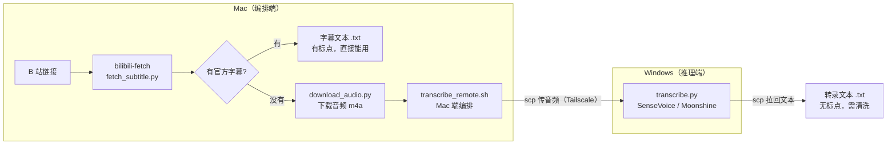

> 这篇文章的目标：你从头到尾跟着做，能自己搓出一套「丢个 B 站链接进去，吐出字幕文本」的工具。不依赖任何现成的 agent skill，所有脚本代码都在文中。

## 它解决什么问题

给一个 B 站链接，最终拿到一段纯文本字幕。中间按视频有没有官方字幕分两条路：

- **有官方字幕** → 直接拉字幕文本
- **没有字幕** → 下载音频 → ASR 转录成文本

整套东西拆成两个独立组件，职责分明、互不耦合：

| 组件 | 跑在哪 | 职责 | 什么时候用 |
| --- | --- | --- | --- |
| **bilibili-fetch** | Mac | 拉字幕，或下载音频 | 一定用 |
| **audio-transcribe** | Mac 编排 + Windows 推理 | 把音频转成文字 | 只在没字幕时用 |

为什么这么拆？拉字幕和转文字是两件完全不同的事——前者只是调 API，后者要跑模型。分开之后，有字幕的视频一秒搞定，不必为它拖着一套 ASR 基础设施；而 ASR 那套机器只在真正需要时才动用。

整体架构一张图：



---

## Part 1：bilibili-fetch（Mac 端）

这一部分只依赖 Python + cookie，任何机器都能跑。

### 1.1 目录结构

找个你喜欢的位置放（下文用 `~/bilibili-tools/bilibili-fetch/`）：

```text
~/bilibili-tools/bilibili-fetch/
├── scripts/
│   ├── fetch_subtitle.py    # 拉字幕
│   └── download_audio.py    # 下载音频
└── .venv/                   # 独立 Python 环境
```

### 1.2 装环境

用独立 venv，只装两个包，跟系统其他东西完全隔离：

```bash
cd ~/bilibili-tools/bilibili-fetch
uv venv .venv                                       # 或 python -m venv .venv
uv pip install --python .venv bilibili-api-python httpx
```

### 1.3 配置 cookie（关键）

B 站对未认证请求有两个限制：**隐藏 AI 字幕**（不登录看不到 AI 生成的字幕）、**下载媒体流返回 HTTP 412**。所以必须带上登录 cookie。

**怎么抠 cookie：**

1. 浏览器打开 `bilibili.com` 并登录
2. 按 `F12` 打开开发者工具 → **Application**（应用）标签 → 左侧 **Cookies** → `https://www.bilibili.com`
3. 找到下面这几个，复制它们的 Value：

| Cookie 名 | 对应配置字段 |
| --- | --- |
| `SESSDATA` | `sessdata` |
| `bili_jct` | `bili_jct` |
| `buvid3` | `buvid3` |
| `buvid4` | `buvid4` |
| `DedeUserID` | `dedeuserid` |

**写进配置文件**，路径 `~/.config/bilibili-subtitle-fetch/config.toml`（XDG 标准位置，脚本默认读这里）：

```toml
[credential]
sessdata = "你的 SESSDATA"
bili_jct = "你的 bili_jct"
buvid3 = "你的 buvid3"
buvid4 = "你的 buvid4"
dedeuserid = "你的 DedeUserID"
ac_time_value = ""   # 浏览器 cookie 里没有这项，留空即可，不影响拉字幕和下音频
```

脚本只读静态 cookie，不自动刷新——过期了就重新抠一次更新这个文件。

### 1.4 拉字幕脚本：fetch_subtitle.py

做的事：解析 BVID → 读 cookie → 调 `Video.get_subtitle()` → 选字幕（优先中文）→ 下载写文件。

```python
#!/usr/bin/env python3
"""从B站视频拉取官方字幕。

输出契约 (stdout/stderr 分离, 便于调用方机械判断):
- 有字幕 → 字幕正文写入输出文件, stdout 输出文件绝对路径。
- 无字幕 → stdout 输出 NO_SUBTITLE, 不写文件。
"""
from __future__ import annotations

import argparse
import asyncio
import re
import sys
import tomllib
from pathlib import Path

import httpx
from bilibili_api import Credential, video

BVID_RE = re.compile(r"BV[1-9A-HJ-NP-Za-km-z]{10}")
SHORT_LINK_RE = re.compile(r"^https?://(?:www\.)?(?:b23\.tv|bili2233\.cn)/")
NO_SUBTITLE_SENTINEL = "NO_SUBTITLE"

CONFIG_PATH = Path.home() / ".config" / "bilibili-subtitle-fetch" / "config.toml"
DEFAULT_LANG = "zh-CN"
UA = (
    "Mozilla/5.0 (Windows NT 10.0; Win64; x64) "
    "AppleWebKit/537.36 (KHTML, like Gecko) Chrome/137.0.0.0 Safari/537.36"
)


def resolve_bvid(text: str) -> str:
    """BVID / 视频 URL / b23.tv 短链 → BV号。"""
    text = text.strip()
    m = BVID_RE.search(text)
    if m:
        return m.group(0)
    if SHORT_LINK_RE.match(text):
        resp = httpx.get(text, follow_redirects=True, timeout=10, headers={"User-Agent": UA})
        m = BVID_RE.search(str(resp.url))
        if m:
            return m.group(0)
    raise SystemExit(f"无法解析 BVID: {text}")


def load_credential() -> Credential:
    if not CONFIG_PATH.exists():
        raise SystemExit(
            f"找不到 credential 配置: {CONFIG_PATH}\n"
            "请在该路径放一个 config.toml, 内含 [credential] 段 "
            "(sessdata / bili_jct / buvid3 / buvid4 / dedeuserid)。"
        )
    data = tomllib.loads(CONFIG_PATH.read_text(encoding="utf-8"))
    cred = data.get("credential", {})
    if not isinstance(cred, dict) or not cred.get("sessdata"):
        raise SystemExit(f"{CONFIG_PATH} 的 [credential] 段缺少 sessdata。")
    return Credential(
        sessdata=cred.get("sessdata"),
        bili_jct=cred.get("bili_jct"),
        buvid3=cred.get("buvid3"),
        buvid4=cred.get("buvid4"),
        dedeuserid=cred.get("dedeuserid"),
        ac_time_value=cred.get("ac_time_value"),
    )


def choose_subtitle(
    subtitles: list[dict], preferred_lang: str
) -> tuple[str | None, str | None]:
    """优先 preferred_lang, 其次非 AI 字幕, 最后任取一个。"""
    for s in subtitles:
        if s.get("lan") == preferred_lang:
            return s.get("subtitle_url"), s.get("lan")
    for s in subtitles:
        if s.get("ai_type", 0) == 0:
            return s.get("subtitle_url"), s.get("lan")
    if subtitles:
        return subtitles[0].get("subtitle_url"), subtitles[0].get("lan")
    return None, None


def normalize_url(url: str | None) -> str | None:
    if not url:
        return None
    if url.startswith("//"):
        return "https:" + url
    if url.startswith(("http://", "https://")):
        return url
    return None


def _timestamp(seconds: float) -> str:
    h = int(seconds // 3600)
    m = int((seconds % 3600) // 60)
    sec = int(seconds % 60)
    ms = int((seconds - int(seconds)) * 1000)
    return f"{h:02}:{m:02}:{sec:02}.{ms:03}"


def format_body(body: list[dict], fmt: str) -> str:
    if fmt == "timestamped":
        chunks = []
        for item in body:
            start = float(item.get("from", 0.0))
            end = float(item.get("to", 0.0))
            content = str(item.get("content", ""))
            chunks.append(f"{_timestamp(start)} --> {_timestamp(end)}\n{content}")
        return "\n\n".join(chunks).strip()
    return "\n".join(str(item.get("content", "")) for item in body).strip()


async def fetch_subtitle(bvid: str, output_format: str) -> str:
    """返回字幕正文; 空串表示无字幕。"""
    cred = load_credential()
    v = video.Video(bvid=bvid, credential=cred)

    info = await v.get_info()
    cid = info.get("cid")
    if not cid:
        raise RuntimeError("无法确定视频 CID。")
    print(f"[info] cid={cid}, aid={info.get('aid')}", file=sys.stderr)

    subtitle_info = await v.get_subtitle(cid=cid)
    subtitles = (
        subtitle_info.get("subtitles", [])
        if isinstance(subtitle_info, dict)
        else []
    )
    langs = [s.get("lan") for s in subtitles]
    print(f"[info] 可用字幕 {len(subtitles)} 条: {langs}", file=sys.stderr)

    if not subtitles:
        return ""

    url, lang = choose_subtitle(subtitles, DEFAULT_LANG)
    url = normalize_url(url)
    if not url:
        return ""

    print(f"[info] 拉取字幕: {lang} -> {url}", file=sys.stderr)
    headers = {
        "User-Agent": UA,
        "Referer": f"https://www.bilibili.com/video/{bvid}/",
    }
    async with httpx.AsyncClient(headers=headers, timeout=15) as client:
        data = (await client.get(url)).json()
    body = data.get("body", [])
    if not body:
        return ""
    return format_body(body, output_format)


def main() -> None:
    p = argparse.ArgumentParser(description="B站视频 → 官方字幕拉取")
    p.add_argument("input", help="BVID / 视频URL / b23.tv 短链")
    p.add_argument("-o", "--output", default=None,
                   help="输出路径 (默认 /tmp/bilibili_subtitle_<BV>.txt)")
    p.add_argument("--format", default="text", choices=["text", "timestamped"],
                   help="字幕输出格式 (默认 text)")
    args = p.parse_args()

    bvid = resolve_bvid(args.input)
    out = Path(args.output or f"/tmp/bilibili_subtitle_{bvid}.txt")

    print(f"BVID: {bvid}", file=sys.stderr)
    print("拉取字幕中...", file=sys.stderr)

    try:
        text = asyncio.run(fetch_subtitle(bvid, args.format))
    except Exception as exc:
        raise SystemExit(f"拉取字幕失败: {exc}")

    if not text:
        print("无官方字幕 (若怀疑 cookie 失效, 检查 config.toml)", file=sys.stderr)
        print(NO_SUBTITLE_SENTINEL)  # stdout
        return

    out.parent.mkdir(parents=True, exist_ok=True)
    out.write_text(text, encoding="utf-8")
    print(f"字幕: {out} ({len(text)} 字符)", file=sys.stderr)
    print(str(out))  # stdout 只输出纯路径


if __name__ == "__main__":
    main()
```

**几个关键设计点：**

- **stdout / stderr 分离**：stdout 只输出「文件路径」或 `NO_SUBTITLE` 这两种结果，所有诊断信息走 stderr。这样调用方可以靠 stdout 机械判断走哪条路，不会被日志干扰。
- **`NO_SUBTITLE` 哨兵值**：无字幕时 stdout 输出固定字符串，而不是空——空 stdout 容易和「出错了」混淆。
- **字幕选择优先级**：优先 `zh-CN`，其次非 AI 字幕（`ai_type == 0`），最后任取。AI 字幕排后面是因为它质量通常不如人工的。
- **`resolve_bvid`** 支持三种输入：纯 BV 号、完整 URL、`b23.tv` 短链（短链会先跟随 302 重定向再从落地 URL 里正则提取）。

### 1.5 下载音频脚本：download_audio.py

做的事：解析 BVID → 读 cookie → 调 `Video.get_download_url()` → 流式下载成 m4a。

```python
#!/usr/bin/env python3
"""从B站视频下载音频 (m4a)。

无字幕时的备选方案: 下载音频交给下游转录。
"""
from __future__ import annotations

import argparse
import asyncio
import re
import sys
import tomllib
from io import BytesIO
from pathlib import Path

import httpx
from bilibili_api import HEADERS, Credential, get_client, video

BVID_RE = re.compile(r"BV[1-9A-HJ-NP-Za-km-z]{10}")
SHORT_LINK_RE = re.compile(r"^https?://(?:www\.)?(?:b23\.tv|bili2233\.cn)/")
CONFIG_PATH = Path.home() / ".config" / "bilibili-subtitle-fetch" / "config.toml"
UA = (
    "Mozilla/5.0 (Windows NT 10.0; Win64; x64) "
    "AppleWebKit/537.36 (KHTML, like Gecko) Chrome/137.0.0.0 Safari/537.36"
)


def resolve_bvid(text: str) -> str:
    """BVID / 视频 URL / b23.tv 短链 → BV号。"""
    text = text.strip()
    m = BVID_RE.search(text)
    if m:
        return m.group(0)
    if SHORT_LINK_RE.match(text):
        resp = httpx.get(text, follow_redirects=True, timeout=10, headers={"User-Agent": UA})
        m = BVID_RE.search(str(resp.url))
        if m:
            return m.group(0)
    raise SystemExit(f"无法解析 BVID: {text}")


def load_credential() -> Credential:
    if not CONFIG_PATH.exists():
        raise SystemExit(
            f"找不到 credential 配置: {CONFIG_PATH}\n"
            "请在该路径放一个 config.toml, 内含 [credential] 段。"
        )
    data = tomllib.loads(CONFIG_PATH.read_text(encoding="utf-8"))
    cred = data.get("credential", {})
    if not isinstance(cred, dict) or not cred.get("sessdata"):
        raise SystemExit(f"{CONFIG_PATH} 的 [credential] 段缺少 sessdata。")
    return Credential(
        sessdata=cred.get("sessdata"),
        bili_jct=cred.get("bili_jct"),
        buvid3=cred.get("buvid3"),
        buvid4=cred.get("buvid4"),
        dedeuserid=cred.get("dedeuserid"),
        ac_time_value=cred.get("ac_time_value"),
    )


async def _download(url: str, file) -> None:
    """bilibili_api 封装的流式下载 (自带绕反爬的 header)。"""
    download_id = await get_client().download_create(url, HEADERS)
    downloaded = 0
    total = get_client().download_content_length(download_id)
    while downloaded < total:
        chunk = await get_client().download_chunk(download_id)
        downloaded += file.write(chunk)


def _pick_url(streams, is_muxed: bool):
    if not streams:
        return None
    if is_muxed:
        return getattr(streams[0], "url", None)
    for stream in streams:
        if stream is None:
            continue
        if hasattr(stream, "audio_quality"):
            return getattr(stream, "url", None)
    return None


async def download_audio(bvid: str) -> BytesIO:
    cred = load_credential()
    v = video.Video(bvid=bvid, credential=cred)
    download_url_data = await v.get_download_url(0)
    detecter = video.VideoDownloadURLDataDetecter(data=download_url_data)
    streams = detecter.detect_best_streams()
    media_url = _pick_url(streams, detecter.check_flv_mp4_stream())
    if not media_url:
        raise RuntimeError("找不到可下载的音频/媒体流。")
    print(f"[info] 媒体流: {media_url[:80]}...", file=sys.stderr)
    file = BytesIO()
    await _download(media_url, file)
    file.seek(0)
    return file


def main() -> None:
    p = argparse.ArgumentParser(description="B站视频 → 音频下载")
    p.add_argument("input", help="BVID / 视频URL / b23.tv 短链")
    p.add_argument("-o", "--output", default=None,
                   help="输出路径 (默认 /tmp/bilibili_<BV>.m4a)")
    args = p.parse_args()

    bvid = resolve_bvid(args.input)
    out = Path(args.output or f"/tmp/bilibili_{bvid}.m4a")

    print(f"BVID: {bvid}", file=sys.stderr)
    print("下载音频中...", file=sys.stderr)

    try:
        audio = asyncio.run(download_audio(bvid))
    except Exception as exc:
        raise SystemExit(f"下载音频失败: {exc}")

    out.parent.mkdir(parents=True, exist_ok=True)
    out.write_bytes(audio.read())
    size_mb = out.stat().st_size / 1024 / 1024
    print(f"音频: {out} ({size_mb:.1f} MB)", file=sys.stderr)
    print(str(out))  # stdout 只输出纯路径


if __name__ == "__main__":
    main()
```

> ⚠️ **不要用 yt-dlp 下 B 站音频**——不带 cookie 会直接 HTTP 412。必须走这个脚本的 credential 通道，`bilibili_api` 的 `get_client().download_*` 自带绕反爬的 header。

### 1.6 跑起来

```bash
cd ~/bilibili-tools/bilibili-fetch

# 拉字幕（脚本会自动判断有无）
.venv/bin/python scripts/fetch_subtitle.py "https://www.bilibili.com/video/BV1xxxxxxxxx"
# stdout = 文件路径  → 有字幕，拿到了
# stdout = NO_SUBTITLE → 没字幕，改走下载音频

# 下载音频
.venv/bin/python scripts/download_audio.py "BV1xxxxxxxxx"
# stdout = /tmp/bilibili_<BV>.m4a
```

到这一步，**有字幕的视频已经拿到文本了，Part 1 就够用**。只有遇到没字幕的视频，才需要继续搭 Part 2。

---

## Part 2：audio-transcribe（无字幕才需要）

这部分要把音频转成文字，需要一台能跑模型的机器。思路是：**Mac 负责编排，Windows 负责推理**，两台机器用 Tailscale 组网。当然你也可以全放一台机器上，这里以双机为例。

### 2.1 为什么这么设计

ASR 模型（尤其中文）吃 CPU/GPU，Mac 跑起来又慢又烫。而 Windows 台式机算力充足，但平时不在手边。所以让 Mac 当「遥控器」：把音频传过去、喊 Windows 跑模型、把结果拉回来。Mac 上不装任何模型。

### 2.2 两个引擎选谁

| 引擎 | 类型 | 适用 | 特点 |
| --- | --- | --- | --- |
| **SenseVoiceSmall** | C++ gguf runtime | 中文（默认） | 约 20 倍实时速度，CER 8.17% |
| **Moonshine** | PyTorch + transformers | 英文/通用 | 滑窗切片，从 HuggingFace 自动拉模型 |

中文视频用 SenseVoice，英文视频用 Moonshine。

### 2.3 Windows 端准备

**目录结构**（路径随便定，下面以 `C:\Users\<你>\pi-asr\` 为例）：

```text
C:\Users\<你>\pi-asr\
├── sensevoice\                      # SenseVoice 引擎（手动放）
│   ├── sensevoice-small-q8.gguf     # 量化模型
│   ├── fsmn-vad.gguf                # VAD（人声检测）模型
│   └── llama-funasr-sensevoice.exe  # C++ 推理二进制
├── scripts\
│   └── transcribe.py                # 转录脚本
├── workspace\                       # 接收 Mac 传来的音频（自动建）
└── output\                          # 转录结果（自动建）
```

**装依赖：**

- **Python 3.10+**（SenseVoice 走外部二进制，不依赖 Python 包；Moonshine 需要 `pip install torch transformers numpy`）
- **ffmpeg**（两端都要有，用来转码音频格式）

**SenseVoice 的三个文件从哪来：**

这套用的是 [FunASR SenseVoiceSmall](https://github.com/modelscope/FunASR) 的 **C++ gguf 量化部署**——模型被转成 gguf 格式，由一个独立的推理二进制加载，不依赖 PyTorch，启动快、速度快。这几个文件（`sensevoice-small-q8.gguf` / `fsmn-vad.gguf` / 推理二进制）需要从社区 gguf 发布页获取，关键词可以搜 `SenseVoice gguf`、`sherpa-onnx sensevoice`、`llama-funasr-sensevoice`。如果你不想折腾 C++ 那套，也可以把脚本里的 SenseVoice 分支换成 sherpa-onnx 的 Python 绑定，逻辑一样。

**Moonshine** 不用手动下模型，脚本里 `from_pretrained("UsefulSensors/moonshine-tiny-zh")` 会自动从 HuggingFace 拉到本地缓存。

### 2.4 Windows 端转录脚本：transcribe.py

做的事：接收音频路径 →（SenseVoice：ffmpeg 转码成 16k WAV → 调推理二进制）/（Moonshine：ffmpeg 解码成 PCM → 滑窗切片推理）→ 写文本。

```python
#!/usr/bin/env python3
"""通用音频转录 (Windows 端, SenseVoice / Moonshine 双引擎)。

Usage:
    python transcribe.py <audio_path> [-o output.txt] [--engine sensevoice|moonshine]
"""
from __future__ import annotations

import argparse
import subprocess
import sys
import time
from pathlib import Path

SENSEVOICE_DIR = Path.home() / "pi-asr" / "sensevoice"


# ─────────────────────────────────────────────────────────────────────
#  SenseVoiceSmall (C++ gguf runtime)
# ─────────────────────────────────────────────────────────────────────
def transcribe_sensevoice(audio_path: str, out_path: str) -> None:
    model = SENSEVOICE_DIR / "sensevoice-small-q8.gguf"
    vad = SENSEVOICE_DIR / "fsmn-vad.gguf"
    binary = SENSEVOICE_DIR / "llama-funasr-sensevoice.exe"
    wav_path = audio_path.rsplit(".", 1)[0] + "_16k.wav"

    for f in (model, vad, binary):
        if not f.exists():
            raise SystemExit(f"缺少引擎文件: {f}")

    # Step 1: 任意格式 → 16kHz mono WAV
    print("转码 (→ WAV 16kHz)...", flush=True)
    subprocess.run(
        ["ffmpeg", "-y", "-i", audio_path, "-ar", "16000", "-ac", "1", wav_path],
        check=True, capture_output=True,
    )

    # Step 2: SenseVoice 推理
    print("转录中 (SenseVoiceSmall, ~20x 实时率)...", flush=True)
    result = subprocess.run(
        [str(binary), "-m", str(model), "--vad", str(vad), "-a", wav_path],
        capture_output=True, text=True, encoding="utf-8", errors="replace",
    )

    output = (result.stdout or "").strip()
    if result.returncode != 0:
        output = f"[stderr]\n{result.stderr}\n\n[stdout]\n{output}"

    Path(out_path).write_text(output, encoding="utf-8")
    print(f"转录完成 → {out_path}", flush=True)
    print(f"总字数: {len(output)}", flush=True)

    Path(wav_path).unlink(missing_ok=True)


# ─────────────────────────────────────────────────────────────────────
#  Moonshine (PyTorch transformers)
# ─────────────────────────────────────────────────────────────────────
def transcribe_moonshine(audio_path: str, out_path: str) -> None:
    import numpy as np
    import torch
    from transformers import AutoProcessor, MoonshineForConditionalGeneration

    torch.set_num_threads(8)
    torch.set_num_interop_threads(8)

    print("加载 Moonshine tiny zh (PyTorch)...", flush=True)
    model = MoonshineForConditionalGeneration.from_pretrained(
        "UsefulSensors/moonshine-tiny-zh"
    ).to("cpu")
    try:
        model = torch.compile(model, mode="reduce-overhead")
        print("  (torch.compile 已启用)")
    except Exception:
        pass
    processor = AutoProcessor.from_pretrained("UsefulSensors/moonshine-tiny-zh")

    # ffmpeg 解码为原始 PCM (无临时文件, 支持任意格式)
    print("加载音频 (ffmpeg 解码)...", flush=True)
    proc = subprocess.Popen(
        ["ffmpeg", "-i", audio_path, "-f", "s16le", "-acodec", "pcm_s16le",
         "-ar", "16000", "-ac", "1", "pipe:1"],
        stdout=subprocess.PIPE, stderr=subprocess.DEVNULL,
    )
    raw = proc.stdout.read()
    proc.wait()
    audio = np.frombuffer(raw, dtype=np.int16).astype(np.float32) / 32768.0
    sr = 16000
    print(f"时长: {len(audio) / sr / 60:.1f} 分钟", flush=True)

    # 滑窗: 15s 片段, 7.5s 步长 (Moonshine max 194 tokens)
    chunk_n = 15 * sr
    stride_n = chunk_n // 2
    token_factor = 13 / 16_000

    results = []
    total = max(1, len(audio) // stride_n)
    t0 = time.time()
    print(f"共 {total} 个片段, 开始转录...", flush=True)

    for i, start in enumerate(range(0, len(audio), stride_n)):
        seg = audio[start:start + chunk_n]
        if len(seg) < sr:
            continue
        inputs = processor(seg, return_tensors="pt", sampling_rate=sr)
        inputs = inputs.to("cpu", torch.float32)
        max_len = min(194, max(1, int(
            (inputs.attention_mask.sum(dim=-1) * token_factor).max().item())))
        ids = model.generate(**inputs, max_length=max_len)
        text = processor.decode(ids[0], skip_special_tokens=True)
        if text.strip():
            results.append(text.strip())

        if (i + 1) % 20 == 0 or i == 0:
            elapsed = (time.time() - t0) / 60
            eta = elapsed / max(1, i + 1) * total - elapsed
            print(f"  {min(100, (i + 1) / total * 100):.0f}% "
                  f"({i + 1}/{total}) | {elapsed:.1f}分 | 预计剩余 {eta:.0f}分",
                  flush=True)

    full = "\n".join(results)
    Path(out_path).write_text(full, encoding="utf-8")
    print(f"\n转录完成 → {out_path}", flush=True)
    print(f"总字数: {len(full)}", flush=True)


# ─────────────────────────────────────────────────────────────────────
#  Main
# ─────────────────────────────────────────────────────────────────────
def main() -> None:
    p = argparse.ArgumentParser(description="通用音频转录 (SenseVoice/Moonshine)")
    p.add_argument("audio", help="音频文件路径")
    p.add_argument("-o", "--output", default=None,
                   help="输出 txt 路径 (默认与音频同目录同名 .txt)")
    p.add_argument("--engine", choices=["sensevoice", "moonshine"],
                   default="sensevoice", help="转录引擎 (默认 sensevoice)")
    args = p.parse_args()

    if not Path(args.audio).exists():
        raise SystemExit(f"音频文件不存在: {args.audio}")

    out = args.output or str(Path(args.audio).with_suffix(".txt"))
    Path(out).parent.mkdir(parents=True, exist_ok=True)
    fn = transcribe_sensevoice if args.engine == "sensevoice" else transcribe_moonshine
    print(f"=== 引擎: {args.engine} ===", flush=True)
    fn(args.audio, out)
    print(out)  # stdout 末行: 纯输出路径, 方便调用方捕获
    print("\n✅ 完成!", flush=True)


if __name__ == "__main__":
    main()
```

**关键点：**

- **SenseVoice 走外部二进制**：不 import 任何模型库，直接 `subprocess` 调 `llama-funasr-sensevoice.exe`，所以 Windows 端甚至不需要装 PyTorch（除非用 Moonshine）。这就是它启动快、速度 20x 实时的原因。
- **ffmpeg 先转 16k 单声道 WAV**：SenseVoice 二进制只吃特定格式，所以先用 ffmpeg 统一转码。
- **Moonshine 的滑窗**：模型有 194 token 上限，所以按 15 秒一片、7.5 秒步长（50% 重叠）切片，逐片推理再拼接。`token_factor` 是经验值，按音频长度动态算每片最多生成多少 token，防止截断。
- **`chcp 65001`**：这行在编排脚本里，强制 Windows cmd 用 UTF-8，防止中文输出乱码。

### 2.5 Mac 端编排脚本：transcribe_remote.sh

做的事：确保 Windows 目录 → scp 传音频 → ssh 跑 transcribe.py → scp 拉回文本。

```bash
#!/usr/bin/env bash
# 通用音频转录编排 (Mac 端)
# 把音频 scp 到 Windows (Tailscale), 转录, 拉回纯文本。
# stdout 只输出文本路径, 日志全走 stderr。
#
# Usage:
#   transcribe_remote.sh <音频路径> [--engine sensevoice|moonshine] [-o out.txt]
set -euo pipefail

# ⚠️ 改成你自己的 Windows 用户名 @ Tailscale IP
WIN='你的用户名@你的Tailscale-IP'
WIN_ROOT='C:\Users\你的用户名\pi-asr'
WORKSPACE="${WIN_ROOT}\\workspace"
OUTPUT="${WIN_ROOT}\\output"
SCRIPT="${WIN_ROOT}\\scripts\\transcribe.py"

engine="sensevoice"
output=""
audio=""

usage() {
  cat <<'EOF'
用法: transcribe_remote.sh <音频路径> [--engine sensevoice|moonshine] [-o out.txt]
  默认引擎 sensevoice (中文最优), 输出 /tmp/<basename>.txt
EOF
}

while [[ $# -gt 0 ]]; do
  case "$1" in
    --engine) engine="$2"; shift 2 ;;
    -o|--output) output="$2"; shift 2 ;;
    -h|--help) usage; exit 0 ;;
    -*) echo "未知选项: $1" >&2; usage >&2; exit 2 ;;
    *) audio="$1"; shift ;;
  esac
done

if [[ -z "$audio" ]]; then
  echo "错误: 缺少音频路径" >&2; usage >&2; exit 2
fi
if [[ ! -f "$audio" ]]; then
  echo "错误: 音频文件不存在: $audio" >&2; exit 2
fi

basename=$(basename "$audio")
win_audio="${WORKSPACE}\\${basename}"
win_out="${OUTPUT}\\${basename}.txt"
# scp 路径用正斜杠（OpenSSH 在 Windows 上的约定）
scp_audio="C:/Users/你的用户名/pi-asr/workspace/${basename}"
scp_out="C:/Users/你的用户名/pi-asr/output/${basename}.txt"
local_out="${output:-/tmp/${basename}.txt}"

echo "[1/4] 确保 Windows 目录" >&2
ssh -o ConnectTimeout=15 "$WIN" "if not exist \"$WORKSPACE\" mkdir \"$WORKSPACE\" & if not exist \"$OUTPUT\" mkdir \"$OUTPUT\"" >&2

echo "[2/4] 传音频: $audio" >&2
scp -o ConnectTimeout=15 "$audio" "$WIN:$scp_audio" >&2

echo "[3/4] 转录中 (引擎: $engine)…" >&2
ssh -o ConnectTimeout=15 "$WIN" "chcp 65001 >nul && set PYTHONIOENCODING=utf-8 && python $SCRIPT \"$win_audio\" -o \"$win_out\" --engine $engine" >&2

echo "[4/4] 拉回结果" >&2
mkdir -p "$(dirname "$local_out")"
scp -o ConnectTimeout=15 "$WIN:$scp_out" "$local_out" >&2

echo "转录完成: $local_out ($(wc -m < "$local_out" | tr -d ' ') 字符)" >&2
echo "$local_out"
```

**要改的地方**（开头三行 + 两个 scp 路径里的用户名）：

- `WIN='你的用户名@你的Tailscale-IP'`
- `WIN_ROOT` 里的用户名
- `scp_audio` / `scp_out` 里的用户名

**前置：Tailscale 组网。** 两台机器都装 [Tailscale](https://tailscale.com/) 并登录同一账号，它们就能用一个虚拟 IP 互通，不用管内网穿透。Mac 上 `ssh 你的用户名@你的Tailscale-IP` 能直接连上就说明通了。建议把 Windows 的 SSH 公钥认证配好，省得每次输密码。

> ⚠️ **不要用 Windows 的 `host_exec` 类工具跑这条线**——这类工具在 Windows 的 cwd 处理上有 bug（`cwd: .` 会让 cmd 报「系统找不到指定的路径」）。本脚本全程 ssh 直连，不受影响。

### 2.6 跑起来

```bash
# Mac 上，拿到音频后
bash transcribe_remote.sh /tmp/bilibili_<BV>.m4a                       # 默认 SenseVoice（中文）
bash transcribe_remote.sh /tmp/bilibili_<BV>.m4a --engine moonshine    # 英文换 Moonshine
# stdout = /tmp/bilibili_<BV>.m4a.txt
```

> **长音频后台跑**——超过 15 分钟的音频会占住终端。30 分钟音频实际转录只要 1～2 分钟（约 20 倍实时）。

### 2.7 转录文本的特点（拿到手心里要有数）

SenseVoiceSmall 输出有三个明显特征：

- **基本没有标点**——大段连续文字，没有句号逗号
- **有少量同音错字**（CER 8.17%，属于正常水平）
- **静音 / 犹豫段偶尔出乱码幻觉**（比如突然冒出几句无关的日文假名）

所以这份纯文本如果要继续加工（比如整理成文章），得先清洗一遍：补标点分段、删幻觉段、修明显错字。

---

## Part 3：完整工作流串起来

两条路殊途同归，最终都在 `/tmp/` 下拿到一份纯文本：

```bash
# ── 第一步：永远先试字幕 ──
.venv/bin/python scripts/fetch_subtitle.py "<B站链接>"
```

**如果 stdout 是文件路径**（有字幕）：

```text
/tmp/bilibili_subtitle_<BV>.txt   ← 带标点，直接能用，结束
```

**如果 stdout 是 `NO_SUBTITLE`**（没字幕）：

```bash
# 第二步：下音频
.venv/bin/python scripts/download_audio.py "<B站链接>"
# → /tmp/bilibili_<BV>.m4a

# 第三步：转录（Mac 编排 → Windows 推理 → 拉回）
bash transcribe_remote.sh /tmp/bilibili_<BV>.m4a
# → /tmp/bilibili_<BV>.m4a.txt   ← 无标点，需清洗
```

到「拿到纯文字」这一步，整套工具的活就干完了。

## 后续

拿到纯文本之后，如果想进一步把它整理成一篇结构化的深度文章，可以再接一层——把这份文本喂给大模型，让它补标点、分段、提炼结构。不过那就是另一个工具的故事了，不在本文范围。
