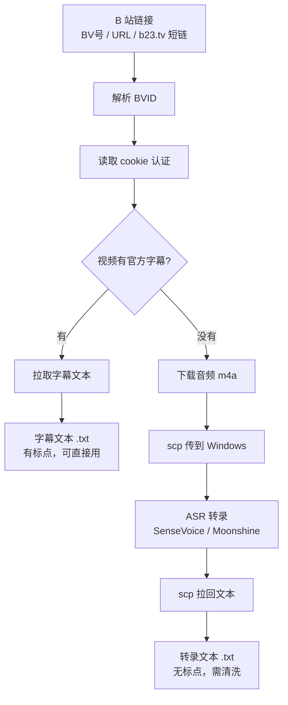

## 这个流程在做什么

给一个 B 站链接，最终拿到一段纯文本字幕。中间按视频有没有官方字幕分两条路：

- **有官方字幕** → 直接拉字幕文本
- **没有字幕** → 下载音频 → ASR 转录成文本

涉及两个 skill，分工是解耦的：

| skill | 职责 | 什么时候用 |
| --- | --- | --- |
| `bilibili-fetch` | 拿字幕，或者拿音频 | 一定用 |
| `audio-transcribe` | 把音频转成文字 | 只在没字幕时用 |

整体流程一张图：



---

## 准备工作（一次性）

### 1. 建 bilibili-fetch 的独立环境

skill 自带一个 venv，只装 `bilibili-api-python` 和 `httpx`，跟系统其他工具完全解耦：

```bash
cd ~/.pi/agent/skills/public/bilibili-fetch
uv venv .venv
uv pip install --python .venv bilibili-api-python httpx
```

### 2. 配置 cookie

B 站对未认证的请求会隐藏 AI 字幕，下音频直接返回 HTTP 412。所以要先准备好登录 cookie，放在 XDG 标准位置：

**路径**：`~/.config/bilibili-subtitle-fetch/config.toml`

```toml
[credential]
sessdata = "..."
bili_jct = "..."
buvid3 = "..."
buvid4 = "..."
dedeuserid = "..."
ac_time_value = "..."
```

这些值从浏览器登录后的 Cookie 里复制。脚本只读静态 cookie，不自动刷新——过期了就手动更新这个文件。

---

## 流程 A：视频有官方字幕

一条命令，脚本会自动判断有没有字幕并拉取：

```bash
cd ~/.pi/agent/skills/public/bilibili-fetch
.venv/bin/python scripts/fetch_subtitle.py "<BV号或URL或短链>"
```

脚本内部依次做了这几件事：

1. **解析 BVID**——支持纯 BV 号、完整视频 URL、`b23.tv` 短链（短链会先跟随重定向再提取）
2. **读 cookie**——从上面的 `config.toml` 加载 credential
3. **拉字幕列表**——调 `Video.get_subtitle()`，拿到所有可用语言
4. **选字幕**——优先 `zh-CN`，其次非 AI 字幕，最后任取一条
5. **下载并写文件**

**输出契约**（这个很重要，调用方靠它机械判断走哪条路）：

- stdout = 字幕文件的**绝对路径**（默认 `/tmp/bilibili_subtitle_<BV>.txt`）→ ✅ 有字幕
- stdout = `NO_SUBTITLE` → ❌ 无字幕，改走流程 B

诊断信息（cid、字幕条数）都走 stderr，不会污染 stdout 的判断。

产物是一份带标点的纯文本字幕，可以直接用。

---

## 流程 B：视频没有字幕

### 第一步：下载音频

```bash
cd ~/.pi/agent/skills/public/bilibili-fetch
.venv/bin/python scripts/download_audio.py "<BV号或URL或短链>"
```

脚本内部依次做了：

1. 解析 BVID、读 cookie
2. 调 `Video.get_download_url()` 拿到媒体流地址（封装自带绕反爬的 header）
3. 流式下载，写入 m4a 文件

stdout 输出音频文件的绝对路径（默认 `/tmp/bilibili_<BV>.m4a`）。

> ⚠️ 不要用 yt-dlp 下 B 站音频——不带 cookie 会直接 HTTP 412。必须走这个脚本的 credential 通道。

### 第二步：音频转文字（audio-transcribe）

拿到 m4a 后，交给 `audio-transcribe` skill。引擎在 Windows 机器上，Mac 端一个编排脚本搞定「传文件 → 转录 → 拉回」：

```bash
cd ~/.pi/agent/skills/public/audio-transcribe
bash scripts/transcribe_remote.sh /tmp/bilibili_<BV>.m4a                       # 默认 SenseVoice（中文）
bash scripts/transcribe_remote.sh /tmp/bilibili_<BV>.m4a --engine moonshine    # 英文音频换 Moonshine
```

脚本内部依次做了：

1. 确保 Windows 上的工作目录存在
2. **scp** 把音频传到 Windows（走 Tailscale）
3. **ssh** 在 Windows 上跑 `transcribe.py`，带上 `chcp 65001` 防中文乱码
4. **scp** 把转录结果拉回 Mac

stdout 输出文本文件的绝对路径（默认 `/tmp/bilibili_<BV>.m4a.txt`），进度日志走 stderr。

> **长音频用 `bg_run` 后台跑**——超过 15 分钟的音频会占住会话。SenseVoice 大约是 20 倍实时速度，30 分钟音频转录只要 1～2 分钟。

### 转录文本的特点（拿到手心里要有数）

SenseVoiceSmall 的输出有三个明显特征：

- **基本没有标点**——大段连续文字，没有句号逗号
- **有少量同音错字**（CER 8.17%，属于正常水平）
- **静音 / 犹豫段偶尔出乱码幻觉**（比如突然冒出几句无关的日文假名）

所以这份纯文本如果要继续加工（比如整理成文章），得先清洗一遍：补标点分段、删幻觉段、修明显的错字。直接用的话质量会被原始文本拖累。

---

## 小结

两条路殊途同归，最终都在 `/tmp/` 下拿到一份纯文本：

- 有字幕 → `/tmp/bilibili_subtitle_<BV>.txt`（带标点，可直接用）
- 没字幕 → `/tmp/bilibili_<BV>.m4a.txt`（无标点，需清洗）

到「拿到纯文字」这一步，bilibili-fetch 的活就干完了。再往下如果要写成深度文章，是另一个 skill（`transcript-to-article`）的事，不在本流程范围内。
