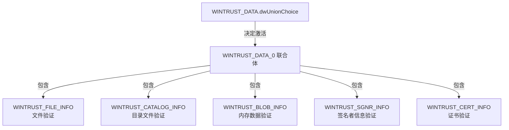

## WinVerifyTrustEx API 介绍

### 什么是 WinVerifyTrustEx API？

WinVerifyTrustEx 是 Windows 操作系统提供的一个核心 API，用于验证数字签名的有效性。它可以检查文件、证书、目录等数字对象的签名，确认其完整性和来源可信度。这个 API 广泛应用于软件安装、文件校验和安全相关的场景，确保用户运行的程序没有被篡改且来自可信任的发布者。


### 原始函数签名

WinVerifyTrustEx 的函数签名如下：

```c
pub unsafe fn WinVerifyTrustEx(
    hwnd: super::super::Foundation::HWND,  // 窗口句柄
    pgactionid: *mut windows_core::GUID,   // 指向验证动作类型的 GUID 指针
    pwintrustdata: *mut WINTRUST_DATA,     // 指向 WINTRUST_DATA 结构体的指针
) -> i32 {  // 返回值：0 表示成功，非 0 表示失败（错误码）
    // 通过 windows_core::link! 宏链接系统中的 wintrust.dll 中的 WinVerifyTrustEx 函数
    windows_core::link!("wintrust.dll" "system" fn WinVerifyTrustEx(
        hwnd : super::super::Foundation::HWND,
        pgactionid : *mut windows_core::GUID,
        pwintrustdata : *mut WINTRUST_DATA
    ) -> i32);

    // 调用链接的函数，传递参数并返回结果
    unsafe { WinVerifyTrustEx(hwnd, pgactionid as _, pwintrustdata as _) }
}
```

参数解析：

| 参数名          | 类型                      | 作用                                                                                                                                                   |
| --------------- | ------------------------- | ------------------------------------------------------------------------------------------------------------------------------------------------------ |
| `hwnd`          | `Foundation::HWND`        | 窗口句柄，用于显示验证过程中可能需要的用户界面（如证书警告对话框）。可设为  `None`（即  `0`）表示无窗口。                                              |
| `pgactionid`    | `*mut windows_core::GUID` | 指向  **验证动作类型 GUID**  的指针，用于指定验证的场景（如文件签名验证、证书信任验证等）。常见值如  `WINTRUST_ACTION_GENERIC_VERIFY_V2`（通用验证）。 |
| `pwintrustdata` | `*mut WINTRUST_DATA`      | 指向  `WINTRUST_DATA`  结构体的指针，包含验证的核心配置（如验证对象类型、UI 选项、吊销检查策略等，前文已详细讲解）。                                   |

### pvTrustData 相关结构体解析

#### WINTRUST_DATA

`WINTRUST_DATA` 这个结构体就像一个大表，包含了验证操作的所有必要信息：

```c
pub struct WINTRUST_DATA {
    pub cbStruct: u32,
    pub pPolicyCallbackData: *mut core::ffi::c_void,
    pub pSIPClientData: *mut core::ffi::c_void,
    pub dwUIChoice: WINTRUST_DATA_UICHOICE,
    pub fdwRevocationChecks: WINTRUST_DATA_REVOCATION_CHECKS,
    pub dwUnionChoice: WINTRUST_DATA_UNION_CHOICE,
    pub Anonymous: WINTRUST_DATA_0,
    pub dwStateAction: WINTRUST_DATA_STATE_ACTION,
    pub hWVTStateData: super::super::Foundation::HANDLE,
    pub pwszURLReference: windows_core::PWSTR,
    pub dwProvFlags: WINTRUST_DATA_PROVIDER_FLAGS,
    pub dwUIContext: WINTRUST_DATA_UICONTEXT,
    pub pSignatureSettings: *mut WINTRUST_SIGNATURE_SETTINGS,
}
```

字段说明：

| 字段名                | 类型                               | 说明                                                                    | 备注                                                                                                                                              |
| --------------------- | ---------------------------------- | ----------------------------------------------------------------------- | ------------------------------------------------------------------------------------------------------------------------------------------------- |
| `cbStruct`            | `u32`                              | 结构体大小（以字节为单位）                                              | 必须初始化（通常设为 `std::mem::size_of::<WINTRUST_DATA>() as u32`），用于 API 版本校验                                                           |
| `pPolicyCallbackData` | `*mut core::ffi::c_void`           | 指向策略回调数据的指针，用于自定义验证策略                              | 通常设为 `ptr::null_mut()`（使用默认策略）                                                                                                        |
| `pSIPClientData`      | `*mut core::ffi::c_void`           | 指向 SIP（Subject Interface Package）客户端数据的指针，用于扩展验证逻辑 | 一般为 `ptr::null_mut()`（使用默认 SIP）                                                                                                          |
| `dwUIChoice`          | `WINTRUST_DATA_UICHOICE`           | 指定验证过程中是否显示用户界面（UI）                                    | 常见值：<br>- `WTD_UI_NONE`（不显示 UI）<br>- `WTD_UI_ALL`（显示所有 UI）                                                                         |
| `fdwRevocationChecks` | `WINTRUST_DATA_REVOCATION_CHECKS`  | 吊销检查策略（控制是否检查证书吊销状态）                                | 常见值：<br>- `WTD_REVOKE_NONE`（不检查吊销）<br>- `WTD_REVOKE_WHOLECHAIN`（检查整个证书链）                                                      |
| `dwUnionChoice`       | `WINTRUST_DATA_UNION_CHOICE`       | 指定要验证的对象类型（决定 `Anonymous` 联合体中使用哪个成员）           | 取值需与 `Anonymous` 中的成员对应，例如：<br>- `WTD_CHOICE_FILE`（验证文件，对应 `pFile`）<br>- `WTD_CHOICE_CATALOG`（验证目录，对应 `pCatalog`） |
| `Anonymous`           | `WINTRUST_DATA_0`（联合体）        | 存储具体验证对象的信息（文件、目录、二进制数据等）                      | 必须根据 `dwUnionChoice` 选择对应的成员初始化（如文件验证需设置 `pFile`）                                                                         |
| `dwStateAction`       | `WINTRUST_DATA_STATE_ACTION`       | 验证状态管理动作（如保存、恢复或删除状态数据）                          | 常见值：<br>- `WTD_STATEACTION_IGNORE`（不处理状态）<br>- `WTD_STATEACTION_VERIFY`（验证并保存状态）                                              |
| `hWVTStateData`       | `Foundation::HANDLE`               | 验证状态数据的句柄（用于保存/恢复验证状态）                             | 若 `dwStateAction` 为 `WTD_STATEACTION_IGNORE`，可设为 `INVALID_HANDLE_VALUE`                                                                     |
| `pwszURLReference`    | `windows_core::PWSTR`              | 指向相关参考 URL 的字符串指针（用于 UI 显示或补充信息）                 | 通常设为 `PWSTR::null()`                                                                                                                          |
| `dwProvFlags`         | `WINTRUST_DATA_PROVIDER_FLAGS`     | 提供程序特定标志（控制验证行为的细节，如是否允许未知发布者）            | 常见值：<br>- `WTD_USE_DEFAULT_OSVER_CHECK`（使用默认系统版本检查）<br>- `WTD_IGNORE_UNKNOWN_CA`（忽略未知证书颁发机构）                          |
| `dwUIContext`         | `WINTRUST_DATA_UICONTEXT`          | 指定 UI 上下文（如管理员模式或用户模式，影响权限相关的 UI 显示）        | 常见值：<br>- `WTD_UICONTEXT_EXECUTE`（执行上下文，如运行程序时验证）<br>- `WTD_UICONTEXT_INSTALL`（安装上下文，如安装软件时验证）                |
| `pSignatureSettings`  | `*mut WINTRUST_SIGNATURE_SETTINGS` | 指向签名验证设置的指针（控制签名验证的细节，如是否检查时间戳）          | 可为 `ptr::null_mut()`（使用默认设置）                                                                                                            |

#### WINTRUST_DATA_0

`WINTRUST_DATA_0` 是一个 **联合体（Union）**，其核心作用是**存储不同类型验证对象的具体信息**。由于联合体的成员共享同一块内存，一次只能使用其中一个成员，因此它需要与 `WINTRUST_DATA` 中的 `dwUnionChoice` 字段配合使用——`dwUnionChoice` 决定了当前激活的是联合体中的哪个成员。

例如：

- 当 `dwUnionChoice = WTD_CHOICE_FILE` 时，必须使用 `pFile` 成员（指向 `WINTRUST_FILE_INFO`）；
- 当 `dwUnionChoice = WTD_CHOICE_CERT` 时，必须使用 `pCert` 成员（指向 `WINTRUST_CERT_INFO`）。

下面是其在 Rust 中的签名

```rust
pub union WINTRUST_DATA_0 {
    pub pFile: *mut WINTRUST_FILE_INFO,
    pub pCatalog: *mut WINTRUST_CATALOG_INFO,
    pub pBlob: *mut WINTRUST_BLOB_INFO,
    pub pSgnr: *mut WINTRUST_SGNR_INFO,
    pub pCert: *mut WINTRUST_CERT_INFO,
}
```

根据验证对象类型的不同，我们需要使用不同的结构体：

- **WINTRUST_FILE_INFO**：用于验证文件的签名
- **WINTRUST_CATALOG_INFO**：用于验证目录中的文件
- **WINTRUST_BLOB_INFO**：用于验证内存中的二进制数据
- **WINTRUST_SGNR_INFO**：用于验证签名者信息
- **WINTRUST_CERT_INFO**：用于验证证书

##### WINTRUST_FILE_INFO：：验证文件的数字签名

用于验证本地文件的数字签名（最常用的场景，如验证 `.exe`、`.dll` 等文件）

| 字段名           | 类型                      | 作用说明                                                             | 初始化要求                                                                      |
| ---------------- | ------------------------- | -------------------------------------------------------------------- | ------------------------------------------------------------------------------- |
| `cbStruct`       | `u32`                     | 结构体大小（字节）                                                   | 必须设为 `std::mem::size_of::<WINTRUST_FILE_INFO>() as u32`                     |
| `pcwszFilePath`  | `windows_core::PCWSTR`    | 指向文件路径的宽字符串指针（如 `C:\app.exe`）                        | 必须非空，需用 `WideString::from_str("路径").as_pcwstr()` 转换为宽字符串        |
| `hFile`          | `Foundation::HANDLE`      | 已打开的文件句柄（可选，与 `pcwszFilePath` 二选一）                  | 若已通过 `CreateFile` 打开文件，可直接传入句柄；否则设为 `INVALID_HANDLE_VALUE` |
| `pgKnownSubject` | `*mut windows_core::GUID` | 指向已知主题类型的 GUID 指针（如驱动程序、系统文件等，通常无需指定） | 一般设为 `ptr::null_mut()`                                                      |

##### WINTRUST_CATALOG_INFO：验证目录中的文件

用于验证"目录文件（`.cat`）"中记录的文件完整性（常见于系统文件或驱动验证，目录文件存储了多个文件的哈希和签名）。

| 字段名                 | 类型                             | 作用说明                                                      | 初始化要求                                                              |
| ---------------------- | -------------------------------- | ------------------------------------------------------------- | ----------------------------------------------------------------------- |
| `cbStruct`             | `u32`                            | 结构体大小（字节）                                            | 设为 `std::mem::size_of::<WINTRUST_CATALOG_INFO>() as u32`              |
| `dwCatalogVersion`     | `u32`                            | 目录版本号（通常为 0，由系统自动处理）                        | 一般设为 0                                                              |
| `pcwszCatalogFilePath` | `windows_core::PCWSTR`           | 目录文件（`.cat`）的路径                                      | 必须非空，指向有效的目录文件路径                                        |
| `pcwszMemberTag`       | `windows_core::PCWSTR`           | 目录中成员文件的标签（可选，用于定位特定文件）                | 可为 `PCWSTR::null()` 或具体标签字符串                                  |
| `pcwszMemberFilePath`  | `windows_core::PCWSTR`           | 要验证的成员文件路径（与目录中记录的文件对应）                | 必须非空，指向需要验证的实际文件                                        |
| `hMemberFile`          | `Foundation::HANDLE`             | 已打开的成员文件句柄（可选，与 `pcwszMemberFilePath` 二选一） | 同 `WINTRUST_FILE_INFO` 的 `hFile` 逻辑                                 |
| `pbCalculatedFileHash` | `*mut u8`                        | 预计算的文件哈希（可选，用于加速验证）                        | 若已计算哈希，指向哈希字节数组；否则设为 `ptr::null_mut()`              |
| `cbCalculatedFileHash` | `u32`                            | 预计算哈希的长度（字节）                                      | 若 `pbCalculatedFileHash` 非空，需设置为实际哈希长度（如 SHA256 为 32） |
| `pcCatalogContext`     | `*mut Cryptography::CTL_CONTEXT` | 目录上下文（通常由系统内部处理）                              | 设为 `ptr::null_mut()` 即可                                             |
| `hCatAdmin`            | `isize`                          | 目录管理员句柄（用于目录数据库操作，一般无需指定）            | 设为 0 即可                                                             |

##### WINTRUST_BLOB_INFO：验证内存中的二进制数据

用于验证内存中二进制数据（而非本地文件）的签名（如网络下载的数据流、内存中的代码块）。

| 字段名             | 类型                   | 作用说明                                                         | 初始化要求                                                          |
| ------------------ | ---------------------- | ---------------------------------------------------------------- | ------------------------------------------------------------------- |
| `cbStruct`         | `u32`                  | 结构体大小（字节）                                               | 设为 `std::mem::size_of::<WINTRUST_BLOB_INFO>() as u32`             |
| `gSubject`         | `windows_core::GUID`   | 数据主题类型的 GUID（如 `WINTRUST_SUBJECT_FILE` 表示文件类数据） | 需指定与数据类型匹配的 GUID                                         |
| `pcwszDisplayName` | `windows_core::PCWSTR` | 数据的显示名称（用于 UI 提示，可选）                             | 可为 `PCWSTR::null()` 或描述性字符串（如 "下载的安装包数据"）       |
| `cbMemObject`      | `u32`                  | 待验证二进制数据的长度（字节）                                   | 必须等于实际数据长度                                                |
| `pbMemObject`      | `*mut u8`              | 指向待验证二进制数据的指针                                       | 必须非空，指向有效的内存数据（需确保内存可访问）                    |
| `cbMemSignedMsg`   | `u32`                  | 签名消息的长度（字节，若数据与签名分离时使用）                   | 若签名单独存储，设为签名长度；否则设为 0                            |
| `pbMemSignedMsg`   | `*mut u8`              | 指向签名消息的指针（若数据与签名分离时使用）                     | 若 `cbMemSignedMsg > 0`，需指向签名数据；否则设为 `ptr::null_mut()` |

##### WINTRUST_SGNR_INFO：验证签名者信息

直接验证签名者信息（`CMSG_SIGNER_INFO`）的有效性，而非完整文件或数据（多用于高级签名解析场景）。

| 字段名             | 类型                                  | 作用说明                                                           | 初始化要求                                                                  |
| ------------------ | ------------------------------------- | ------------------------------------------------------------------ | --------------------------------------------------------------------------- |
| `cbStruct`         | `u32`                                 | 结构体大小（字节）                                                 | 设为 `std::mem::size_of::<WINTRUST_SGNR_INFO>() as u32`                     |
| `pcwszDisplayName` | `windows_core::PCWSTR`                | 签名者的显示名称（用于 UI 提示，可选）                             | 可为 `PCWSTR::null()` 或签名者名称                                          |
| `psSignerInfo`     | `*mut Cryptography::CMSG_SIGNER_INFO` | 指向签名者信息结构体的指针（核心字段，包含签名算法、签名者证书等） | 必须非空，指向已初始化的 `CMSG_SIGNER_INFO` 实例                            |
| `chStores`         | `u32`                                 | 证书存储的数量（用于验证签名者证书的信任链）                       | 若指定自定义证书存储，设为存储数量；否则设为 0（使用系统默认存储）          |
| `pahStores`        | `*mut Cryptography::HCERTSTORE`       | 指向证书存储句柄数组的指针                                         | 若 `chStores > 0`，需指向有效的证书存储句柄数组；否则设为 `ptr::null_mut()` |

##### WINTRUST_CERT_INFO：直接验证证书

直接验证证书（`CERT_CONTEXT`）的有效性（如检查证书是否过期、是否被吊销、是否由受信任机构颁发）。

| 字段名             | 类型                              | 作用说明                                             | 初始化要求                                                                             |
| ------------------ | --------------------------------- | ---------------------------------------------------- | -------------------------------------------------------------------------------------- |
| `cbStruct`         | `u32`                             | 结构体大小（字节）                                   | 设为 `std::mem::size_of::<WINTRUST_CERT_INFO>() as u32`                                |
| `pcwszDisplayName` | `windows_core::PCWSTR`            | 证书的显示名称（用于 UI 提示，可选）                 | 可为 `PCWSTR::null()` 或证书名称                                                       |
| `psCertContext`    | `*mut Cryptography::CERT_CONTEXT` | 指向证书上下文的指针（核心字段，包含证书的完整信息） | 必须非空，指向已加载的 `CERT_CONTEXT` 实例（可通过 `CertOpenCertificateContext` 获取） |
| `chStores`         | `u32`                             | 证书存储的数量（用于验证证书信任链）                 | 同 `WINTRUST_SGNR_INFO` 的 `chStores` 逻辑                                             |
| `pahStores`        | `*mut Cryptography::HCERTSTORE`   | 指向证书存储句柄数组的指针                           | 同 `WINTRUST_SGNR_INFO` 的 `pahStores` 逻辑                                            |
| `dwFlags`          | `u32`                             | 验证标志（如是否忽略时间有效性检查）                 | 通常设为 0（使用默认逻辑）；特殊场景可设 `WTD_CERT_IGNORE_NOT_TIME_VALID` 等           |
| `psftVerifyAsOf`   | `*mut Foundation::FILETIME`       | 验证的时间点（可选，用于检查证书在特定时间是否有效） | 可为 `ptr::null_mut()`（使用当前时间）；否则指向特定 `FILETIME` 实例                   |

##### 结构体关系图



## 代码示例

下面是一个简单的示例：

```rust
use std::{mem::size_of, ptr};
use windows::core::{PCWSTR, PWSTR};
use windows::Win32::Foundation::{HANDLE, HWND};
use windows::Win32::Security::WinTrust::{
    WinVerifyTrustEx, WINTRUST_ACTION_GENERIC_VERIFY_V2, WINTRUST_DATA, WINTRUST_DATA_0,
    WINTRUST_DATA_UICONTEXT, WINTRUST_FILE_INFO, WTD_CHOICE_FILE, WTD_REVOKE_NONE,
    WTD_STATEACTION_CLOSE, WTD_STATEACTION_VERIFY, WTD_UI_NONE, WTD_USE_DEFAULT_OSVER_CHECK,
};

fn signature(path: &str) -> bool {
    // 6. 把 path 改成 PCWSTR
    let mut path_str = path.encode_utf16().collect::<Vec<u16>>();
    path_str.push(b'\0' as u16);
    let path_ptr = PCWSTR(path_str.as_mut_ptr());

    // 5. 创建 WINTRUST_FILE_INFO 结构体
    let mut file_info = WINTRUST_FILE_INFO {
        cbStruct: size_of::<WINTRUST_FILE_INFO>() as u32, // 结构体大小
        pcwszFilePath: path_ptr,                          // 一个 PCWSTR 类型，代表文件路径
        hFile: HANDLE::default(),                         // 默认
        pgKnownSubject: ptr::null_mut(),                  // 默认
    };

    // 4. 定义 WINTRUST_DATA_0，由于我们设置的是`dwUnionChoice: WTD_CHOICE_FILE`，所以我们只需要`pFile`
    let wintrust_data_0 = WINTRUST_DATA_0 {
        pFile: &mut file_info as *mut _,
    };

    // 3. 准备 WINTRUST_DATA 结构体
    let mut wintrust_data = WINTRUST_DATA {
        cbStruct: size_of::<WINTRUST_DATA>() as u32, // 结构体大小，为 u32 类型
        pPolicyCallbackData: ptr::null_mut(), // 设置为 null_mut() 表示我们不使用任何自定义的回调函数来在验证过程中途干预。
        pSIPClientData: ptr::null_mut(), // 设置为 null_mut() 表示不向 SIP（主题接口包）提供任何额外的数据。
        dwUIChoice: WTD_UI_NONE, // 不显示 UI，即使签名无效或不受信任，也不要弹出任何警告窗口。
        fdwRevocationChecks: WTD_REVOKE_NONE, // 不检查吊销，跳过联网检查证书吊销列表（CRL）
        dwUnionChoice: WTD_CHOICE_FILE, // 验证文件
        Anonymous: wintrust_data_0, // 准备验证文件的 WINTRUST_DATA_0 联合体
        dwStateAction: WTD_STATEACTION_VERIFY, // 启用验证，这会初始化并保留验证状态的句柄（hWVTStateData），这会在内存里占用资源，记得释放资源
        hWVTStateData: HANDLE::default(),      // 直接默认
        pwszURLReference: PWSTR::null(),       // 我们不需要它，设为null
        dwProvFlags: WTD_USE_DEFAULT_OSVER_CHECK, // 告诉系统使用它自己的默认版本检查逻辑
        dwUIContext: WINTRUST_DATA_UICONTEXT(0), // 仅在 dwUIChoice 不是 WTD_UI_NONE 时才有意义，我们禁用了UI，这里设为 0
        pSignatureSettings: ptr::null_mut(),     // 使用默认行为（验证第一个签名）
    };

    // 2. 定义我们要做的操作的 GUID，需要的类型为: `*mut windows_core::GUID`
    let mut action_id = WINTRUST_ACTION_GENERIC_VERIFY_V2;

    // 1. 调用 WinVerifyTrustEx
    let result = unsafe {
        WinVerifyTrustEx(
            HWND::default(),    // 窗口句柄，默认 0
            &mut action_id,     // GUID
            &mut wintrust_data, // WINTRUST_DATA 结构体
        )
    };

    // 7. WTD_STATEACTION_VERIFY 会验证并返回一个状态句柄到 hWVTStateData，释放这个句柄需要再次调用 WinVerifyTrustEx，并且把 dwStateAction 设置为 WTD_STATEACTION_CLOSE。
    wintrust_data.dwStateAction = WTD_STATEACTION_CLOSE;
    unsafe {
        WinVerifyTrustEx(HWND::default(), &mut action_id, &mut wintrust_data);
    }

    match result {
        0 => true,
        _ => false,
    }
}

fn main() {
    let path = "D:/SoftWare/Weixin/Weixin.exe";
    let code = signature(path);
    println!("Code: {}", code);
}

```

运行效果：

```powershell
D:/Env/Rust/.cargo/bin/cargo.exe run --color=always --package WinVerifyTrustEx --bin WinVerifyTrustEx --profile dev
    Finished `dev` profile [unoptimized + debuginfo] target(s) in 0.05s
     Running `target\debug\WinVerifyTrustEx.exe`
Code: true

进程已结束，退出代码为 0
```
