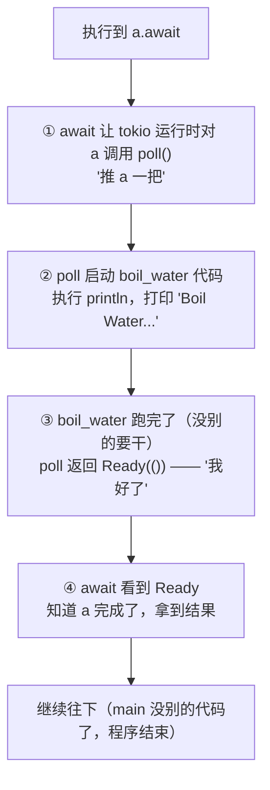

```rust
async fn boil_water() {
    println!("Boil Water...")
}
```

它和普通函数的区别在于：普通函数的返回要么是一个空类型，要么是返回某一个具体的类型；但是 Async 函数返回的是一个 Future，Future 可以理解为一个盒子。

之所以说它返回 Future，是因为异步的特点。先澄清个概念：CPU 在不同线程/进程之间跳，那叫**多线程/多进程**，不是异步。异步的本质是 CPU 在**一个线程内**，来回跳不同的**协程/任务**——Rust 的 async 走的就是协程这条路。也就是说，Rust 的异步本质上是 CPU 在一个线程里，来回跳不同的协程。这里可能会涉及到某一个协程的暂停和恢复，我们可以把它包装一下。包装之后，就是把这段代码或这个函数包装成一个东西，这个新的东西可以被暂停、被恢复，它就叫 Future。

好，那么我们怎么使用这个东西呢？我们上面那一步定义好了这个异步函数，但它其实还没有出现 future。future 是怎么出现的呢？

```rust
async fn boil_water() {
    println!("Boil Water...")
}

fn main() {
    let a = boil_water();
}
```

好，这里 A 就是那个 future。那么我们怎么跑呢？我们这里可以把这个 future 看作是一个压缩包，我们想要使用一个代码，需要双击打开它对吧？这里我们使用 `.await`。

> 哦，对了，这里需要装一下 tokio。

```rust
use tokio;

async fn boil_water() {
    println!("Boil Water...");
}

#[tokio::main]
async fn main() {
    let a = boil_water();
    a.await;
    println!("Done!");
}
```

通过这样方式，你就可以使用那个 future 了。这里注意一下，它是同步的，也就是说，先等这个 A 这个 future 跑完之后，它才会去打印。

那么这个 `.await` 到底是怎么做的呢？他其实就是推了一把，hhhh。



> 这里理论上来说会有一个 waker 唤醒机制的，下面会讲。

看到这里可能会问：这怎么能叫异步呢？这跟常规理解的异步好像不太一样吧？它这不还是在同步等待状态吗？这不还是在等待那个函数的返回 ready 吗？

那我们就需要有两个任务。

```rust
use tokio;

async fn boil_water() {
    println!("Boil Water...");
}

async fn cut_vegetables() {
    println!("Cut Vegetables...");
}

#[tokio::main]
async fn main() {
    let a = boil_water();
    let b = cut_vegetables();
    a.await;
    b.await;
    println!("Done!");
}
```

现在有了一个烧水的任务和一个切菜的任务。但是我们现在知道了。awaits 它其实还是在去同步跑，A 跑完之后才能跑 B，那么怎么做到异步呢？

我们可以想一想，正常来说应该是后台去运行对吧？比如说，我们后台同时在跑烧水跟切菜，这两个人是并行的，互相不影响的是吧？Rust 这里使用的是协程，不过道理也是一样的。在宏观尺度上，它们两个是在**并发**运行的（看起来同时）；在微观尺度上，CPU 会一会儿在跑任务 A，一会儿在跑任务 B。那这里又有一个问题了，他是怎么做的呢？

Rust 在单个线程里头，其实就是在跑 `poll()`，可以理解为它是在一个线程里头，当前这个线程里来回切来切去。A 开始之后，先开始跑 A。如果 A 因为一些原因停止了，那就再去跑 B。如果 B 再因为一些原因停止了，再去跑 A。这里会有一个等待的问题。

首先第一点，假设现在正在跑任务 A。

任务 A 遇到了需要阻塞的状态，进入了 sleep 两秒的状态，然后开始切换到任务 B 上。假设任务 B 在正常完成工作、不阻塞的状态下需要 5 秒（当然这只是夸张的，因为正常情况下它不可能用这么长时间）。那么，任务 A sleep 两秒之后，任务 B 其实还在工作。这个时候会发生什么呢？是会继续在任务 B 上工作，等 B 工作完之后再切回 A 呢？还是说立刻切回 A，接着进行 A 的工作？

> 这里有一个叫做 Waker 的概念。Waker 本质上是一个**回调函数**——任务挂起时把它注册给底层（比如定时器、操作系统的 IO 通知），然后它就**被动地挂在那里等**，不主动轮询。等的事件发生了（sleep 到时间、网络数据到达），底层就会**触发**这个 waker（调用它），waker 再通知运行时："我好了，来重新 poll 我"。所以它是**事件驱动**的：被动等事件来触发它，被触发后叫醒 runtime。

答案是等 B 工作完之后再切回 A，因为协程是协作式的，它不是像线程那种抢占式的。抢占式是由操作系统决定的，而协作式其实是由任务自己决定，需要任务自己把所谓的 runtime 放出来。因为 A 进入了阻塞状态，所以它需要把 runtime 放出来，这样就可以跑别的任务。但是在跑 B 的时候，B 倾向于把自己的任务再干完。因为它也没有进入阻塞状态，那么 B 就没有理由把 runtime 放出来。

还有另一种情况：

1. 任务 A 需要 10 秒，任务 B 需要 20 秒。
2. 任务 A 跑到一半时，突然需要停三四秒。
3. 任务 B 在跑的时候，又突然停下来，需要停三四秒。

大概就是这个样子。

| 时刻 | CPU 在干啥 | 烧水 | 切菜 |
| --- | --- | --- | --- |
| **t=0** | poll 烧水：加水、点火 → 撞上"等水开"挂起 | 在跑 → 挂起 (等 3 秒) | 还没轮到 |
| **t=0+** | poll 切菜：洗菜 → 撞上"等沥干"挂起 | 挂起 | 在跑 → 挂起 (等 5 秒) |
| **t=0++** | 两个都挂起，CPU 空闲睡觉等闹钟 | 挂起 | 挂起 |
| **t=3** | 烧水 waker 响 → 恢复 poll 烧水（关火、倒水…连续跑，不让出） | 恢复跑（霸占 CPU） | 挂起 |
| **t=5** | 切菜 waker 响！但 CPU 被烧水占着 → 切菜排队 | 还在跑（霸占） | 就绪但排队 |
| **t=10** | 烧水跑完 → CPU 释放 → poll 切菜（切菜、装盘） | 完成 | 恢复跑 → 完成 |

OK，概念清楚了，现在看代码。想要实现我们刚才上面所说的这个东西，Rust 里用的是 `join!`。

```rust
use tokio::time::{Duration, sleep};

async fn boil_water() {
    println!("Boil Water...");
    sleep(Duration::from_secs(5)).await;
    println!("Water is ready!");
}

async fn cut_vegetables() {
    println!("Cut Vegetables...");
    sleep(Duration::from_secs(5)).await;
    println!("Vegetables are ready!");
}

#[tokio::main]
async fn main() {
    let now = std::time::Instant::now();
    tokio::join!(boil_water(), cut_vegetables());
    println!("Done!");
    println!("Elapsed: {:?}", now.elapsed());
}
```

OK, 看到烧水他会花 5 秒，切菜他也会花 5 秒。我们用 join 来同时跑这两个东西，并记录一下时间。如果是同步的话，那就是 10 秒钟；如果是异步的话，时间不一定。我们看一下结果。

```shell
trtyr@demotestdeMacBook-Air Study % cargo run
    Blocking waiting for file lock on build directory
   Compiling Study v0.1.0 (/Users/trtyr/Documents/Study)
    Finished `dev` profile [unoptimized + debuginfo] target(s) in 12.35s
     Running `target/debug/Study`
Boil Water...
Cut Vegetables...
Vegetables are ready!
Water is ready!
Done!
Elapsed: 5.001389583s
trtyr@demotestdeMacBook-Air Study %
```

看到这两个任务同时跑，其实就花了 5 秒钟时间。

好，这里又有个问题：为什么这个 sleep 需要用 await？为什么我们不能用 STD 的标准库的 sleep 呢？因为它是 future，future 里不能阻塞。你可以想一下，**异步**的意义就是为了能够让 CPU 从这个 future 跑到另一个 future 里头，也就是从这个任务跳到另一个任务里。如果说你这里阻塞了，CPU 就停在这儿不动了，那肯定不行啊。原版标准库的 sleep 是**线程**的东西（std::thread::sleep），它肯定会阻塞，CPU 会在这里等它完成。所以，我们这里要用 Tokio 库提供的不会阻塞的 sleep。

结合我们上面说的，每一个 await 其实跑的是一个 future。那我们这里其实就是 future 嵌套 future。

> 这里有点像 Windows 的 DLL Main，DLL Main 会卡死整个加载器。这一点两者挺像的。
