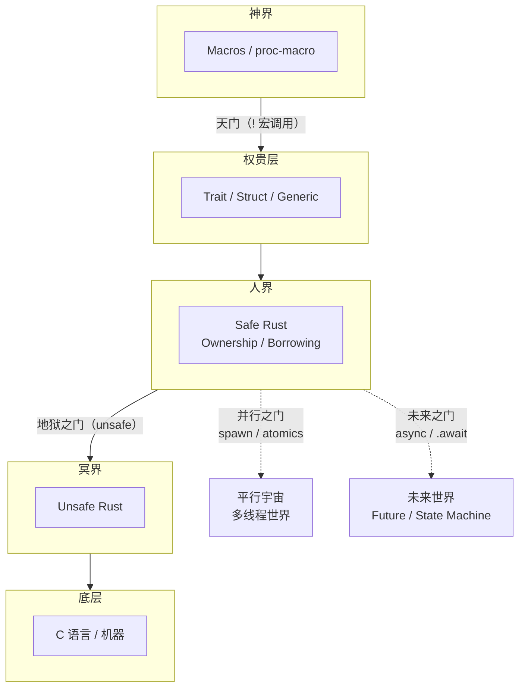

**来源：** 本文整理自 B 站视频。

<iframe src="https://player.bilibili.com/player.html?bvid=BV1zLDwYuEQn" width="100%" height="400" scrolling="no" border="0" frameborder="no" framespacing="0" allowfullscreen="true"></iframe>

---

## 一、核心框架：三界四洲 —— Rust 的宇宙观

主讲人用一套极其生动的比喻搭建了整个视频的元框架——「三界四洲」这个名字直接借自《黑神话：悟空》的世界观——把 Rust 语言的各个层面映射到一个宇宙结构中：

这个框架的核心洞见是：**Rust 把计算机科学中不同层次的问题做了明确的隔离和分层**——分隔的界限本身就是 Rust 的语法标记。`!`（宏调用末尾的感叹号）是"天门"，通往神界；`unsafe` 关键字是"地狱之门"，通往冥界。Safe Rust（人界）是普通人安居乐业的日常世界——ownership 和 borrowing 浸染在 everywhere，保证你不会写出内存 bug。但 Safe Rust 有两类能力无法覆盖：一是需要开后门（unsafe），二是需要对接 C 语言/裸机器（冥界），因为 Safe Rust 是一个"不受外族入侵的世界"，有些操作天然无法在其中实现。往上走，trait、struct、generic 是"权贵阶层"——他们锦衣玉帛，可以玩出非常多的花样，代表的是一种极高的抽象。再往上升维，proc-macro 让你在**语言层面**做抽象——主讲人称之为"跳出天门"，因为你甚至可以定义一门全新的 DSL，"一旦你能自定义语法了，那你就拥有整个世界了。"

横向上，spawn/atomics 打开「并行之门」进入多线程世界。进去之后你会发现代码跟你平时的差不多——而且神界（宏）和冥界（unsafe）在这里都能用，所以并行世界"expand 很大的一个范围"，这些都是基础设施。async/.await 打开「未来之门」——核心区别在于："**你只描述不执行。**" 你像做计划一样描述明天要干什么，但执行的时间不由你控制。最关键的是，不同人写的"未来计划"必须能够精密的组合在一起——"未来是可以组合的"。Future 本质是一个 state machine，主讲人认为这是 Rust 最深邃的部分。我们平常玩的 combination 是函数和表达式的组合，但 **state machine 之间的组合**是一个更罕见、更困难的问题——"你很少玩过 state machine 有没有一个很好的组合方式啊。" 这也是 async/await 迟迟难以彻底稳定的根本原因：它在解决一个上升到图灵层面的终极问题。

> 主讲人特别指出：**"语法只是表象，我们要通过语法看穿本质。"** Rust 的每一个大特性都在解决编程中的一个本质问题，不是堆砌语法糖。他还点出一个容易被忽略的事实："我们写 C 语言中其实并不关心，并没有意识到这个东西——大家已经习惯了不安全，但在 Rust 里非常强调安全，所以显得不安全那么的另类。"

他还做了一个大胆的论断：**"这四点就是语言的全部，没有其他东西了。"** —— Safe Rust、unsafe Rust、macro、多线程/并行、async/未来，这五块构成了 Rust 语言的全集，而且"每一点都在解决核心问题。" 另外还有一个重要的架构细节：并行和未来这两个横向世界与中土大唐（Safe Rust）"隔离的就不多了"——换句话说，多线程和 async 更像是 Safe Rust 的扩展，而 unsafe 和 macro 才是真正截然不同的世界。并行世界里神界和冥界都能用，所以"这些都是基础设施"，不是割裂的孤岛。

---

## 二、分主题深入

### 2.1 抽象的三重轮回：用 · 组 · 抽

主讲人反复引用 [SICP（Structure and Interpretation of Computer Programs）](https://sarabander.github.io/sicp/)——他特别指出 SICP "根本不是在教你编程语言，是在教你编程思想，整本书所有的章节都在教你如何抽象"。同时提及了伯克利将原版 SICP 用 Python 重写的"软化"版本——"要不然觉得原来的 SICP 太硬核了。"

SICP 原版四章的递进结构本身就是一座抽象的金字塔：第一章用 procedure（函数）来抽象，第二章用数据来抽象，第三章用对象来抽象，第四章叫 **Metalinguistic Abstraction**——在语言层面上的抽象，"整个换一个语言。" 主讲人认为 SICP 特别牛的地方在于："它的每一章节都是一个 big step，都是 non-trivial 的 big step。"

从 SICP 中提炼出的「三重轮回」：

| 阶段 | 英文 | 中文提炼 | 含义 |
|------|------|----------|------|
| Primitive | Primitive expressions | **用** | 原子性的基本元素，可以直接使用 |
| Combination | Means of combination | **组** | 把基本元素组合成更大的结构 |
| Abstraction | Means of abstraction | **抽** | 给组合后的结构命名、隐藏细节、暴露接口 |

这三个阶段形成一个闭环（loop）：你用 primitive 来组合 → 组合后的产物经抽象又变成新的 primitive → 进一步组合……如此**轮回循环**，"这三个怼到一起，它就会形成你对程序的不断贴近真实的复杂度，你的程序会慢慢健全健壮去贴近复杂度。" 主讲人特意把三个英文词凝练为三个汉字「用 · 组 · 抽」——"用"是因为 primitive 像原子一样好用；"组"是组合；"抽"是抽象。

一个语言只要把这三种能力 management 得好，就会是一个不错的语言。在 Rust 的「三界四洲」中：

- **人界**（ownership/borrowing）主要解决 **primitive** 问题——给你安全好用的原子操作，让你"好组"
- **权贵层**（trait/struct/generic）主要解决 **combination** 和 **abstraction**——"STRUCT 啊 trait 啊 generic 啊，他其实玩的就是 combination"
- **神界**（macros）几乎纯粹在玩 **abstraction**——在语言层面做抽象
- **冥界**（unsafe）玩的是最底层的 **primitive**——"你要把它呈现出来的更好"
- **未来之门**（Future）玩的是更深的东西——**state machine 的 combination**

> SICP 第四章 "Metalinguistic Abstraction"——主讲人认为 Rust 的宏正是在干这件事：让你可以**自定义语法**。"一旦你能自定义语法了，那你就拥有整个世界了。"

---

### 2.2 编程语言的精神谱系：Rust 在填补一道缺口

这是视频最有深度的部分。主讲人展示了两张关键图片（他称之为"编程语言的精神"）来论证 Rust 的独特地位。

**第一张图：从人到机器的光谱**

```mermaid
graph LR
    subgraph 人类逻辑
        A[Lisp / Haskell<br/>纯函数式<br/>没有 mutation]
    end
    subgraph 中间层
        B[Python / Java<br/>有 mutation + 存储<br/>GC 保底]
    end
    subgraph 系统层
        C[C++ / Rust<br/>手动管理资源<br/>RAII]
    end
    subgraph 机器
        D[C / Assembly<br/>完全手动<br/>一对一映射]
    end
    
    A --> B --> C --> D
```

关键洞察：**从逻辑层面到机器层面，程序越来越"不纯"，越来越需要管理资源（尤其是资源的释放）。**

- 最上层（Lisp/Haskell）：你写的代码跟数学表达式几乎一样，没有 mutation，没有存储概念，最贴近人类思维
- 中间层（Python/Java/JavaScript）：加入了 **mutation**（对象状态的修改）和**存储**概念，但有 GC 做保底，你不用管释放
- C++ 层：开始需要你手动管理**资源释放**（RAII）
- C/Assembly 层：纯手动挡，所有状态都得你来管。主讲人在这里有一个极为犀利的论断：**"C 基本上相当于汇编。C 语言比汇编增加的唯一的东西就是函数调用那一点点 overhead——就是所谓的 calling convention。其他地方基本上是一比一的映射。"** C 的抽象是极少的，但这不是优点——"C 的语法确实简单，但问题是，它做的跟真实的复杂度的接口也简单，所以你才容易写错代码。就是因为它言语少，它的抽象能力低，所以它表达不了很多真实世界的复杂度。"

往下的终点是图灵机状态机——"你其实来回来去都在操作一个状态，操作一个内存，你要来负责管理它的所有状态。"主讲人用「手动挡 / 自动挡」的比喻来总结这一整条梯度的核心差异：越往上越自动挡，越往下越手动挡。

这中间有一个本质的分界线：**assembly（汇编）**。"在汇编代码以下全是机器的东西，在汇编代码以上全是人能接受的东西——只不过人的接受程度从非常高层的更偏向逻辑，慢慢往下走。" 而在最顶层（Lisp/Haskell），"它非常纯粹，它没有那些噪音，写出来的代码跟你人在数学上写出来的公式，或者你脑子里想的东西非常贴近。" 主讲人还抛出一个令人意外的论断："**Python 其实已经挺接近 Lisp 了。**"

另外，这片光谱也可以从 **Church vs Turing** 的双塔视角来理解——主讲人在之前的视频「计算本质」中讲过这个"双塔传说"：Church 的 λ 演算在光谱顶端，靠近人类思维；Turing 的图灵机在光谱底端，靠近机器。

**Rust 在做什么？** 主讲人认为，从人类逻辑到机器之间这片 gap 里，**"基本上只有 C++ 这一个人在去扛这块地方"**——Java 应该归到 Python/GC 那一类。Rust 的野心就是把整条光谱从上到下都覆盖：它从 ML/OCaml/Lisp 继承了函数式的抽象能力（代数数据类型、模式匹配、类型推断），又从 C++ 继承了系统编程的控制力（RAII、智能指针、move 语义、内存模型），还要吃下多线程、异步这些横向维度。"rust 就尝试着去往天上走，他想把整个上面这一块全吃掉——他的野心是很大的。"

还有一个重要的补充：**语言从高到低的两个关键跃迁点**，其他小特性都不重要——第一个是 **mutation（状态修改）的加入**，第二个是**资源释放的加入**。"在上面连对象的概念都没有，就像我们数学一样——你写的那些数学公式其实都是表达式，算来算去的，根本就没有存储。" 在纯函数式语言中，没有 mutation，没有存储概念，这是最纯粹、最"美好"的。Python/JS 开始有存储和 mutation，但有 GC 做保底。到 C++ 层面，你必须手动管理释放。"资源的申请和释放——释放尤其重要，释放尤其麻烦。"

> 主讲人的原话："别的语言没干的事情，他在填补一个空白。别的语言忽略的但是有很重要的一件事情。如果有别的语言能干这个事情，我可能也会喜欢别的语言。但是目前来说没有，我也没办法。这就是为什么我个人对 Rust 有独特钟爱的感觉。"

---

### 2.3 从 constant 到 mutation：程序的「不安指数」

第二张图（来自 Charles 的 "Order Matters" talk，主讲人在「扫地僧 C++」系列里用两集专门介绍）展示了一个从舒服到崩溃的 object 操作谱系：

| 阶段 | 操作方式 | 心理状态 |
|------|---------|---------|
| No object | 纯表达式 / 纯数字 | 最舒适 |
| Constant object | 对象不可变（"像天堂的程序一样，那是最完美的"） | 很舒服 |
| Computed object | 每次重新计算，不动原对象——"有点像 React，每次想改的时候你选择去创建一个新的 object，而不是改原来的" | 还行 |
| Overwritten object | 整体替换——在 Rust 里就是 `let a = b` 的 move 语义，或 `*a = b` 通过解引用完整替换 | 开始难受——"对你的推理，你大脑推理就开始产生一些障碍了" |
| **Mutated object** | 原地修改——`a.field = x`，只改一个字段 | **非常紧张（very nervous）** |

这张图的终点写着 "very nervous"——为什么程序老出 bug？就是因为 mutation。主讲人补充说，Charles 这张图没有把**资源释放**（manually deallocation）加进去，"如果加到最后的话，它会导致三个 fault 让你很崩溃——这叫 nervous meter。"

主讲人强调：**原地修改跟整体替换其实不是一回事**，但大多数语言没有区分它们。Niko Matsakis（Rust 语言设计团队成员）最近在 Baby Steps 博客上写了一系列文章，提出引入一个 [Overwrite trait](https://smallcultfollowing.com/babysteps/blog/2024/10/14/overwrite-and-pin/) 来精确区分这两者——"他还想引入一个新的 trait 来区分这两件事情。" 主讲人自己也说"这个地方还挺有意思的，我还在思考。"

> "你别看 Rust 语言看着复杂，它在真正解决这些核心问题。它解决的点都是要点——他在真正找这些要点。"

---

### 2.4 Rust 的血统：官方 Influences 清单

主讲人翻阅了 [Rust Reference 的 Influences 页面](https://doc.rust-lang.org/reference/influences.html) ——这是官方文档对 Rust 语言血统的权威说明：

| 来源语言 | 引入的特性 |
|----------|-----------|
| **SML / OCaml** | 代数数据类型、模式匹配、类型推断、分号语句分隔 |
| **C++** | 引用、RAII、智能指针、move 语义、单态化（monomorphization）、内存模型 |
| **ML Kit / Cyclone** | 基于区域的**内存管理**（region-based memory management）——这是 Rust 生命周期（lifetime）系统的学术源头 |
| **Haskell (GHC)** | typeclasses → trait、type families |
| **Newsqueak / Alef / Limbo** | channel、并发模型 |
| **Erlang** | 消息传递、线程失败处理、轻量级并发 |
| **Swift** | optional binding |
| **Scheme / Lisp** | 卫生宏（hygienic macros）——Rust 宏的直接祖先 |
| **C#** | attributes |
| **Ruby** | closure 语法 |

几个值得注意的细节：

1. **类型推断不是从 C++ 的 `auto` 来的**，而是从 OCaml/ML 系函数式语言来的。同样地，不加分号等于返回这个设计也来自函数式语言的 "everything is an expression"。

2. **Rust 的创始人本身就是 OCaml 爱好者**——他最初的想法只是把 OCaml 变得更「实战化」一点。"编程语言里面有两派，一大派是学院派，一大派是实战派。函数式思想往往是学院派的，因为它好证明——非常完美的证明你这个程序没 bug。实战派的那些就 mutation 这些东西很难证明。" Rust 从学院派的 OCaml 出发，不断往实战派靠拢，最终把两个世界的精华融合在了一起。

3. Rust 每借鉴一个特性都把它**极致泛化**——"Rust 每借鉴一个特性以后，他都在想这个特性我能用在哪里，尽可能用的越多越好，everywhere。" 比如 C# 的 attribute，在 Rust 中不仅可以标记 struct/field/function/函数参数，还能标记任意 statement，"就非常的灵活，非常极其灵活。" 而且 attribute 的背后就是宏——"只要带 `#` 的都是宏。" 比如 `#[cfg(test)]`、`#[derive(Debug)]`、crate-level 的 `#![...]`，"多了去了，它几个东西充分的组合起来能量是多强大。" attribute 的深层意义在于：**不影响你程序逻辑的前提下，给你程序的这些元素（语法树上的元素）添加一些额外的信息，然后这些信息可以用来指导你的程序变得更加玩法多样。**

4. **Rust 跟 Go 是差不多同步发展的，同时起步的。** 这是一个容易被忽略的历史事实。

5. **OCaml 的 `let` 语法**是主讲人特别推崇的设计：在 OCaml 里，定义变量和定义函数用的是**同一个语法**—— `let add x y = x + y` 定义函数，`let sum = add 3 4` 得到数据 `7`，但 `let sum = add 3` 得到的是一个部分应用的**函数**。"它模糊了数据跟函数或者跟代码的界限——我靠，这个完全就是极致的函数式的精髓啊！" 主讲人认为 Rust 在这方面不如 OCaml，因为 Rust 区分了 `fn` 和 `|x|` 两个不同的语法来表示函数和闭包。

6. 主讲人反复强调：**"Rust 作者本身就是个多元爱好者。"** 从 Influences 清单就能看出来——"小孩子才做选择，我全都要。" 而 Rust 的独特之处在于**"他从神界借了很多东西，把他带到人间——让你们感受一下这个人间的强大。"**

---

### 2.5 Unsafe Rust 的两种用途

主讲人把 unsafe 的使用场景归纳为两类，简洁有力：

1. **对接 C 语言 / 靠近机器**：比如 `union` 在 safe Rust 中基本不用（用的是 `enum`），union 纯粹是为了跟 C 的接口。"union 他把 union 的一些操作认为是 unsafe——那就是因为 union 这个东西，你在正常的 safe 中根本就不会用它，你用的都是 enum。" Rust 对 C 比较友好——可以根据 C 头文件自动生成 FFI 接口。

2. **开后门**：Safe Rust 为了保证「中土大唐」的安全——"不受外族入侵的世界"——有些操作无法在 safe 中实现，需要通过 unsafe 开后门来补充。

> "所以如果我们在看 unsafe 的材料中，能分清楚哪些是为了开后门、哪些纯粹是为了对接 C 语言，你就能看得更清楚。"

主讲人还补充了一个看完 Rustonomicon 之后的感受：**"C 实在是太裸了。原来在 C 语言之上还可以玩出这么多东西——即使是 unsafe 的情况下。"**

---

### 2.6 主讲人的翻译哲学

主讲人自己翻译了 [The Rustonomicon](https://doc.rust-lang.org/nomicon/)（Rust 死灵书），并在视频中分享了他的翻译理念——这部分内容虽然偏离 Rust 技术本身，但对技术内容创作者极有启发。他对比了已有的中文翻译（rustme 点），指出了传统翻译方式的根本问题：

**传统翻译的三大问题：**

1. **失真**：硬翻成中文后读起来"很怪"——"有些意思你硬翻成中文的话，它读起来很怪"
2. **关键词丧失**：英文 keywords 的那种精准感被磨平——"那种英文 keywords 的感觉消失了"
3. **缺乏辅助材料**：这是和文学作品翻译最本质的区别——"文学作品它本身的内容是自洽的，不需要辅助材料就能看懂，所以你直翻就行了。但是在技术材料里面它是非常深的，互相关联的，需要有些难的东西，你是没有办法直翻的——或者直翻的话就非常难懂。"

**他的方案（"意译"而非"直译"）：**

- 口水话（70-80%）：直译成中文没问题，"相当于某种意义上的压缩"——既不损失原本精确的含义，又提高了阅读效率
- 关键话（20-30%）：尽量保留英文原词，并加入自己的理解和补充材料——"甚至一些关键地方要加充分的补充材料"
- 双括号 `【】` 标注自己的注解和基础知识补充
- **"我哪怕损失，我都要往人身上贴。"** 不追求原汁原味，追求的是"人"能理解
- 不追求文字的优雅和语法正确——"大脑能力足够强，零零散散的看到一些字，你都能推出它的意思。那个不是关键，关键是信息量和阶梯感和信息密度。" 他甚至直言："我的思维发散得很厉害，有时候突然讲到 A 突然想到 B 突然讲到 C。我写出来的文字呢，我不追求文字的优雅性以及语法上的正确性。"
- 文档里引了 Rust Reference 的哪些章节，他直接就把那些章节的内容也加进来——"我会加非常多的附加材料"，文字感受不了的地方还会加图示

> 他把这种方法类比为大学老师讲课：数学是极其客观的东西，但如果只给你符号，你看不懂——"它必须经过一定软化，必须要加入老师对这个东西的理解。" 他还举了杨振宁给清华大一学生讲物理的视频为例："那种大师风范，绝对是教材上体现不出来的东西。" 他进而指出了一个更根本的洞见：**"技术讲到一定程度以后，你会发现它里面有些哲学思考，包括主观的东西在里面——它不是一个纯粹客观的东西。"**

---

### 2.7 语言的全貌：冥界、平行宇宙与未来世界的进阶地图

视频的后半段，主讲人画出了学完"中土大唐"（Safe Rust）之后要进入的三块大内容——这是他规划的教学路线图：

**冥界（Unsafe Rust）**：核心参考是 The Rustonomicon，"教你怎么写 unsafe，这个问题要考虑多少因素。" 对应的最佳学习路径是：先把 Comprehensive Rust 的 unsafe 部分快速过一遍，然后需要深入时打开 Rustonomicon。

**平行宇宙（多线程/并发）**：核心参考是 Mara Bos 的《Rust Atomics and Locks》，主讲人也做了批注——"把口水话全都干掉，不要口水话，直直奔主题，直接去标注一些重点。" 如果再往下追，就会触及 **cache coherence（缓存一致性）** 和 **memory consistency（内存一致性）** 这两个底层问题——但主讲人强调"你要先会用，先在上层会用它，你才能知道它在干啥，才有追求底下的好奇心。"

**未来世界（Async）**：核心参考是 Jon Gjengset 的《Rust for Rustaceans》——"周神（Jon Gjengset）他就是 Tokio 的主要贡献者，在 async 这块是比较权威的。" 但主讲人也承认 async 还有很多未解决的问题——"**Pin 呀什么那些东西还没有再解决。**"

> 主讲人总结："这三部分展开了，这整个语言就算完事了。编程无止境嘛，学无学可以一直学下去——里面有很多技巧可以一直往下走下去。"

此外，他还计划做一个 **short introduction**——以最快的速度把 Rust 全部语言特性过一遍，配合 live coding。推荐的学习资源补充：

- **cos.rs / Rust By Practice (practice.rs)**：通过有挑战性的练习实战
- **Too Many Linked Lists**："以写链表的一个实战去教你把整个语言的所有特性全串起来——而且这个链表又非常有用，你在做一个活的同时，这个活本身有用，而且你学到的东西整个又联系起来"
- **Rust Cookbook**：看一些代码样例
- **rustlings**：官方小型练习
- 对于官方文档，主讲人直言"太长了，看官方文档就不如 cos.rs 了"

---

## 三、引用索引

### 书籍

- **《Structure and Interpretation of Computer Programs (SICP)》** — Harold Abelson, Gerald Jay Sussman — [MIT OCW](https://ocw.mit.edu/courses/6-001-structure-and-interpretation-of-computer-programs-spring-2005/) · [在线阅读](https://sarabander.github.io/sicp/) — 视频的核心理论框架来源，尤其第四章 "Metalinguistic Abstraction"
- **《The Rustonomicon》（Rust 死灵书）** — Rust 官方 — [官方在线阅读](https://doc.rust-lang.org/nomicon/) · [GitHub](https://github.com/rust-lang/nomicon) · [中文翻译](https://nomicon.purewhite.io/) — unsafe Rust 的核心参考资料
- **《Comprehensive Rust》** — Google Android 团队 — [官方站点](https://google.github.io/comprehensive-rust/) · [GitHub](https://github.com/google/comprehensive-rust) — 主讲人正在讲授的课程
- **《Rust Atomics and Locks》** — Mara Bos — [官网](https://mara.nl/atomics/) · [GitHub](https://github.com/m-ou-se/rust-atomics-and-locks) · [O'Reilly](https://www.oreilly.com/library/view/rust-atomics-and/9781098119447/) — 并发/并行世界的进阶读物
- **《Rust for Rustaceans》** — Jon Gjengset — [官网](https://rust-for-rustaceans.com/) · [No Starch Press](https://nostarch.com/rust-rustaceans) — Async/高级 Rust 的权威参考，Tokio 主要贡献者

### 演讲/PPT

- **"Order Matters" talk** — Charles — 主讲人在「扫地僧 C++」系列中介绍，展示了从 constant object 到 mutated object 的「不安指数」谱系图（注：未找到公开链接）
- **CCCI 2021 某演讲** — 展示了一张从人类逻辑到机器的编程语言光谱图（注：未找到公开链接）

### 博客

- **Niko Matsakis — Baby Steps: Overwrite Trait 系列** — [smallcultfollowing.com/babysteps](https://smallcultfollowing.com/babysteps/blog/2024/10/14/overwrite-and-pin/) — 提出 Overwrite trait 来区分"整体替换"和"原地修改"

### 论文

- **"Region-Based Memory Management"** — Mads Tofte, Jean-Pierre Talpin — [IC 1997](https://www.irisa.fr/prive/talpin/papers/ic97.pdf) — Rust 生命周期系统的学术源头
- **"A Retrospective on Region-Based Memory Management"** — Mads Tofte et al. — [HoSC 2004](https://elsman.com/mlkit/pdf/retro.pdf) — 对 region-based 方案的回顾

### 工具/练习

- **rustlings** — [GitHub](https://github.com/rust-lang/rustlings) · [官网](https://rustlings.rust-lang.org/) — Rust 官方小型练习题集
- **Rust By Practice (practice.rs)** — [中文站](https://practice-zh.course.rs/) · [GitHub](https://github.com/sunface/rust-by-practice) — 有挑战性的 Rust 练习题
- **Learn Rust With Entirely Too Many Linked Lists** — [在线阅读](https://rust-unofficial.github.io/too-many-lists/) · [GitHub](https://github.com/rust-unofficial/too-many-lists) — 通过写链表实战 Rust
- **Rust Cookbook** — [在线阅读](https://rust-lang-nursery.github.io/rust-cookbook/) · [GitHub](https://github.com/rust-lang-nursery/rust-cookbook) — Rust 生态常用任务的示例集

### 编程语言

视频中作为对比和溯源涉及的语言：**OCaml, SML, Haskell, Scheme/Lisp, C, C++, C#, Ruby, Swift, Erlang, Python, Java, Go**

---

## 四、主讲人观点与方法论

### 核心观点

1. **"编程计算机科学就在抽象。"** 从 ownership（"ownership 只是对那些不安全的操作做了一个抽象——其实它也是抽象啊"）到 SICP 的全书结构（用函数抽象、用数据抽象、用语言抽象），抽象是唯一贯穿的主线。"整个编程计算机科学就在抽象，它抽象出来以后呢，让你不那么容易写错程序了——最多编译不过，但是它不会让你写出一个内存有漏洞的程序。"

2. **固有复杂度不是语言的错。** "你不能因为固有复杂度而否定一门语言——你看着语法复杂，那是固有复杂度。并不是说你写的语法少了，你这个语言就是牛逼的。很多 case 你覆盖不到。" 这段话不仅适用于 Rust，更是一个评价编程语言的元标准。

3. **Rust 在填补一块别的语言忽略的重要空白。** 从人的逻辑到机器之间有一道巨大的 gap，"基本上只有 C++ 这一个人在去扛这块地方"——Rust 的出现从根本上改变了局面。它从天上（函数式语言）借了很多东西带到人间，让普通人也能感受到那些抽象的力量。"如果有别的语言能干这个事情，我可能也会喜欢别的语言。但是目前来说没有。"

4. **"大家都是打篮球的，有的人是乔丹，有的人只是一个无名小卒。State machine 的历史地位是超级高的——一直上升到图灵层面的。"** 主讲人用篮球做比喻：在编程概念里，state machine 就是乔丹级别的存在。Future 的困难不是 Rust 语法的问题，而是 state machine 本质上的复杂度——编译器如何生成完美的 state machine，state machine 之间如何组合——这些都是根上的问题。"如果这个问题一旦解决的话，它其实在解决一个非常根上的问题。"

5. **多语言爱好者视角。** 主讲人自认是「多语言爱好者」——"国外的编程社区里面也有很多人是多元的。" Rust 作者本身就是这样的人——"小孩子才做选择，我全都要。" 从 Influences 清单里你可以看到 Rust 吃了多少家的百家饭。

6. **"在最上层的语言中，你基本上构造不出来太多不合理的程序。在下面呢，你太容易构造出来太多不合理的程序了。"** 这个洞见解释了为什么我们需要更安全的语言——不是语法糖的问题，而是语言设计的底层约束决定了你能写出多么离谱的 bug。

### 值得记住的比喻

- 「三界四洲」「南天门」「地狱之门」——用《黑神话：悟空》的神话世界观理解 Rust 分层。叹号 `!` 是天门，`unsafe` 是地狱之门
- 「用 · 组 · 抽」——把 SICP 的三重抽象循环凝练成三个汉字，"用"来自"原子"的谐音和本义
- 「双塔传说」（Church vs Turing）——从之前的视频「计算本质」延续的比喻：Church（λ 演算）在光谱顶端靠近人类思维，Turing（图灵机）在底端靠近机器
- 「手动挡 / 自动挡」——从函数式（自动挡）到 C（手动挡），"越往下越手动挡，越往上越自动挡"
- 「very nervous」——来自 Charles 的图，mutation 让人紧张。如果加上手动资源释放就是 "nervous meter" 爆表
- 「大家已经习惯了不安全」——C 程序员根本不会意识到自己写的是 unsafe 代码，"在 C 里面根本就没有感觉到这个东西"
- 「全都要」——Rust 作者的创作心态：小孩子才做选择，我全都要

### 学习和进阶路线

主讲人将 Rust 的完整学习路径规划为：Comprehensive Rust 全覆盖 → 实战练习（cos.rs / practice.rs / Too Many Linked Lists / rustlings）→ 冥界（The Rustonomicon）→ 并行（Rust Atomics and Locks，进一步追到 cache coherence & memory consistency）→ 未来（Rust for Rustaceans），之后计划做一个 short introduction 配合 live coding 快速串讲。
