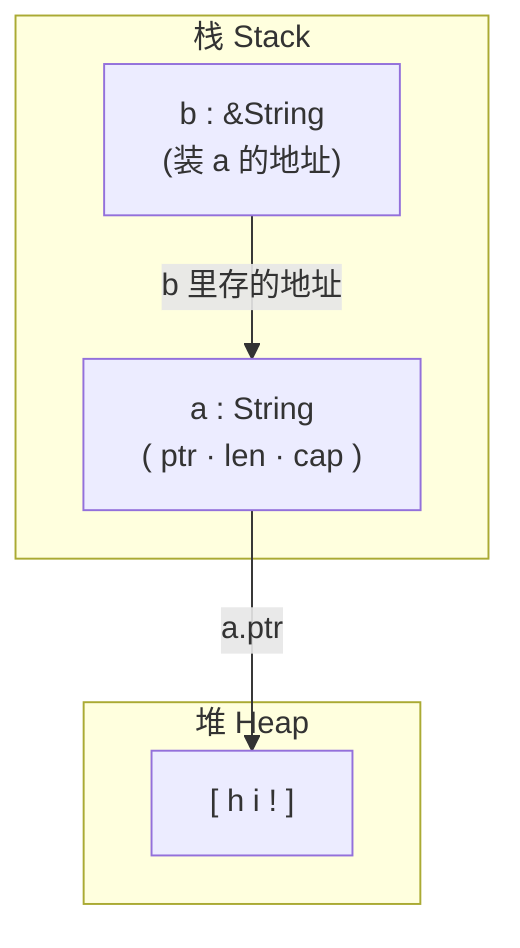

最近重新捡起了 Rust，发现自己把 mut 和 & 有点忘了

## mut 可变

mut 代表的是可变变量，见下面的代码

```rust
fn main() {
    let a = 1;
    a = 2;
}
```

此时，因为 a 没有被设置为 `mut`，所以下面的 `a = 2` 是不合理的，这时候我们要么加 `mut`，要么 shadow

```rust
fn main() {
    // 加 mut
    let mut a = 1;
    a = 2;
    println!("{}", a);

    // shadow
    let b = 10;
    let b = 20;
    println!("{}", b);
}
```

这个东西还是比较简单的，但是稍微复杂一点。

```rust
fn main() {
    let a = String::from("hi!");
    a = 12;
}
```

这里比较简单，a 是先被定义成了 String 类型，然后下面的 `a = 12` 一方面 a 不是 `mut` 的，另一方面，a 的类型已经被确定了，无法变成其他类型。

```shell
trtyr@demotestdeMacBook-Air Study % cargo run
   Compiling Study v0.1.0 (/Users/trtyr/Documents/Study)
error[E0308]: mismatched types
 --> src/main.rs:3:9
  |
2 |     let a = String::from("hi!");
  |             ------------------- expected due to this value
3 |     a = 12;
  |         ^^ expected `String`, found integer
  |
help: try using a conversion method
  |
3 |     a = 12.to_string();
  |           ++++++++++++

For more information about this error, try `rustc --explain E0308`.
error: could not compile `Study` (bin "Study") due to 1 previous error
trtyr@demotestdeMacBook-Air Study %
```

可以看到他是这个报错。

就有一个问题了。首先我们先来回顾一下 String 类型。String 类型的本质是一个栈上有个指针去指向堆上的数据。可以理解为栈上有一个盒子，这个盒子里包含 `ptr`、`len`、`capacity`，其中的 `ptr` 指向堆上的那个数据。

> 具体 String 类型啥样，看：[Rust Language Cheat Sheet](https://cheats.rs/)

那么 `let mut a = String::from("hi!");`，这里到底什么是可变的呢？是堆上的数据可变吗？还是栈上的那个 String 盒子变了呢？我们看看怎么操作的 String 就知道了

```rust
fn main() {
    let mut a = String::from("hi!");
    a.push_str("hi!");
    println!("{}", a);
}
```

可以发现 a 的变化，动的是 a 这个盒子里的东西（比如 ptr）。也就是说，`mut a` 的本质上，可变的是 **a 这个盒子**（含 ptr/len/cap），而不是堆上的数据。堆上的数据"看起来变了"，是因为盒子里的 ptr 改了，指向了新堆。

那么我们就可以知道了，`mut x` 那么就 x 可变，mut 啥，啥变。

## & 引用，可变引用跟不可变引用

引用这个就是常见的指针概念了，只不过因为 Rust 有了可变和不可变的概念，那么引用也就存在着可变引用和不可变引用。

先看一个简单的代码。

```rust
fn main() {
    let a = 10;
    let b = &a;
    println!("{}", b);
}
```

乍一看，以为 B 会是一个地址，结果打印出来的结果却是 10。这是因为 `{}`，他这里有一个 display trait，所以，你打印出来的不是地址。如果想打印出来的是地址，需要加 `:p`

```rust
fn main() {
    let a = 10;
    let b = &a;
    println!("{:p}", b);
}
```

我们再来看下一段代码。

```rust
fn main() {
    let a = String::from("hi!");
    let b = &a;
    println!("{}", b);
}
```

这里 B 还是 A 的引用，只不过 A 现在变成了一个 string 类型。那么其实它的数据结构是这个样子的。



OK，了解完数据结构，我们看看引用，我们刚才说了，它其实分成可变引用跟不可变引用。目前它就是一个不可变引用，我们可以测试一下。

```rust
fn main() {
    let a = String::from("hi!");
    let b = &a;
    b.push_str("hi!");
}
```

这里就会报错

```shell
trtyr@demotestdeMacBook-Air Study % cargo run
   Compiling Study v0.1.0 (/Users/trtyr/Documents/Study)
error[E0596]: cannot borrow `*b` as mutable, as it is behind a `&` reference
 --> src/main.rs:4:5
  |
4 |     b.push_str("hi!");
  |     ^ `b` is a `&` reference, so it cannot be borrowed as mutable
  |
help: consider changing this to be a mutable reference
  |
3 |     let b = &mut a;
  |              +++

For more information about this error, try `rustc --explain E0596`.
error: could not compile `Study` (bin "Study") due to 1 previous error
trtyr@demotestdeMacBook-Air Study %
```

这里我们可以这么理解：

1. 可变变量：对于可变变量来说，它可以存在不可变引用和可变引用。你可以把这个变量看作一个实体，它会有两个"突触"（即生物学上神经突触的概念）。因为它是可变的，所以它会有"不可变引用"的突触和"可变引用"的突触。如果另一个实体想要做引用，就可以同时连到这两个突触上。
2. 不可变变量：如果这个变量是不可变变量，那么它就只有一个突触，也就是只读的"不可变引用"突触。这意味着它是无法被修改的，另一个实体想要引用过来，只能通过不可变引用的那条线连过来。

```rust
fn main() {
    let mut a = String::from("hi!");
    let b = &mut a;
    b.push_str("hi!");
}
```

这么改就好了。

那这里还有一个问题。可以看到，我们这个 b 其实并没有加 mut，但是 b 也做了 push_str 的操作。那么，为什么 b 不用加 mut 呢？这是因为 push_str 用的是 b 作为 `&mut`（可写引用）的能力，不是 b 自己可变——Rust 在这里帮你做了一些隐藏操作。所以说 b 根本就没变，变的是 a 的数据，也就是堆上的那块数据。

如果要是这样

```rust
fn main() {
    let a1 = String::from("hi!");
    let a2 = String::from("Hello World");
    let b = &a1;
    b = &a2;
}
```

这样可能才是一个展现 mut 可变相关的例子。可以看到，这里 B 想从 a1 的引用变成 a2 的引用，但是因为 B 不是可变的，所以它就变不了。在 B 前面加 mut 就可以了。

```rust
fn main() {
    let a1 = String::from("hi!");
    let a2 = String::from("Hello World");
    let mut b = &a1;
    b = &a2;
}
```

## 指针

指针难道跟引用不是一个东西吗？你可以理解为，在 Rust 中，被编译器处理过的安全指针就是引用；而这里说的"指针"指的是裸指针，即底层 FFI 的裸指针。Rust 还有一个智能指针。

在 Rust 中，引用是 `&T`，裸指针是 `*const T`，智能指针说的是，那些带着数据的指针，比如说 `String`、`Box`、`Rc` 等等。

指针跟引用的底层都是地址，智能指针的底层其实是地址加上元数据。不过要注意：**引用是借用**（借用完就还，不拥有数据），**裸指针只是个地址**（连"借"都谈不上，它没有所有权/借用语义）；而我们的智能指针是拥有数据的。裸指针其实没有任何安全措施，引用由编译器做一些安全措施，而智能指针不仅有编译器的支持，还有一些运行时的安全措施。我们刚才看见的引用跟智能指针，它们其实是有自动解引用的。不过智能指针跟引用还有个区别：引用出作用域时，它自己会消失，但**不会销毁它指向的数据**（数据归主人管）；而智能指针出作用域时，会**自动 drop 它拥有的数据**。从大小来看，引用和裸指针本质上都是地址，所以它们都是 8 位的东西，但是智能指针的大小就不一定了。
