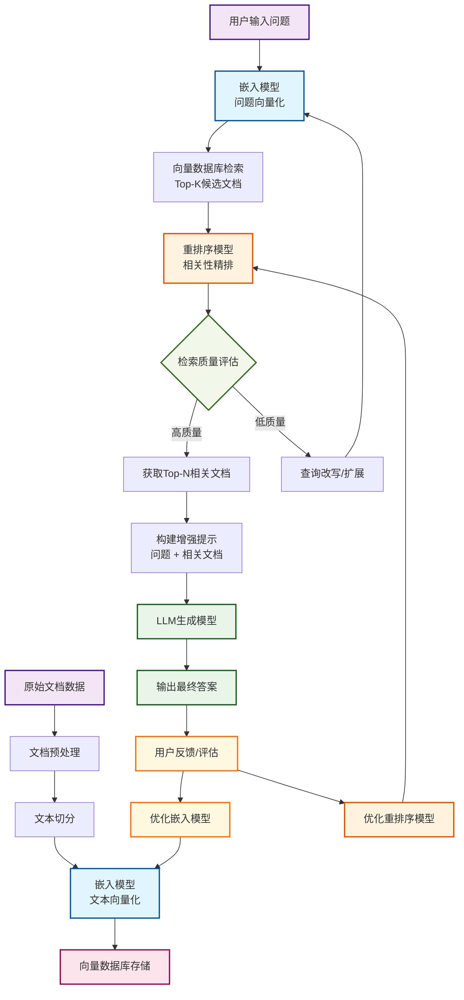
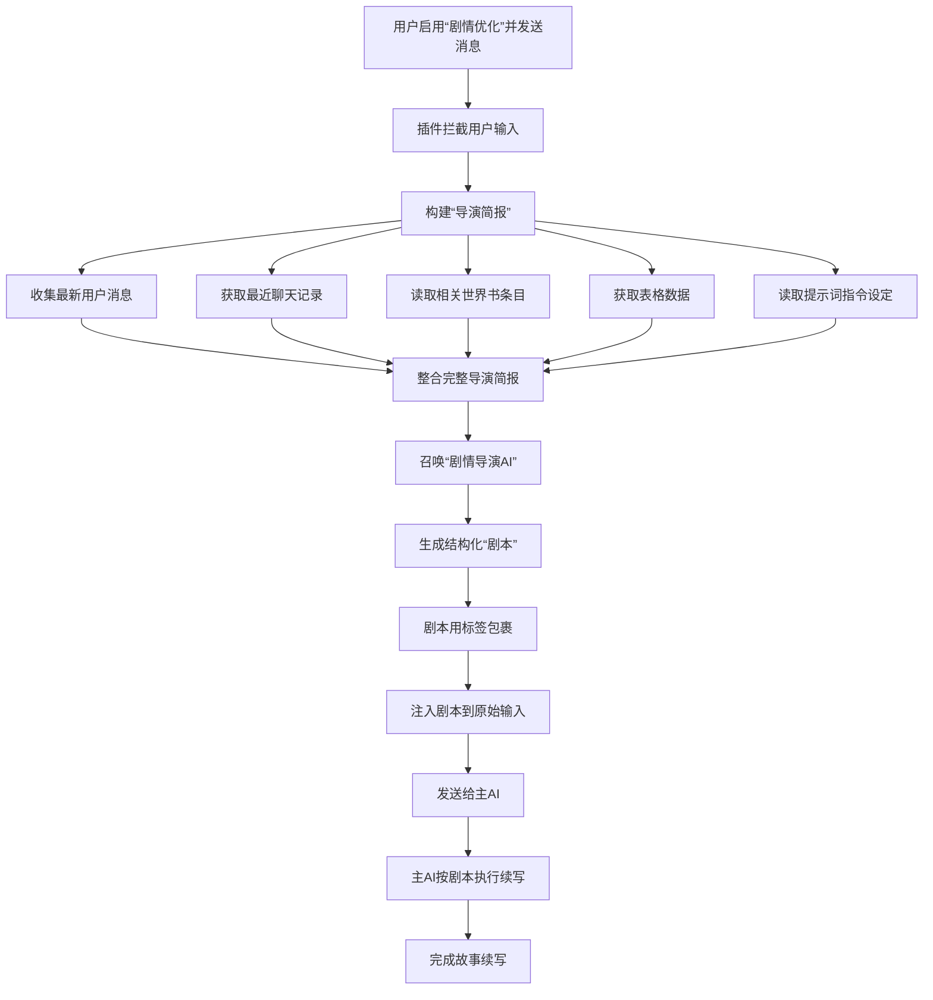

今天发现了一个新的插件 - Amily2，功能还挺多的，学习一下这个插件。

> 该指南为 v1.5.3 版本，具体的功能请按照实际版本为准

## 简介

1. 发布地址：Discord "类脑" 社区：https://discord.com/channels/1134557553011998840/1393908367377956965
2. 项目地址：https://github.com/Wx-2025/ST-Amily2-Chat-Optimisation.git
3. 官方说明文档：https://docs.google.com/document/d/11E7HIFg59up0afv-lV0cAF5G3jzJXCkZK8cBCOMZ9zo/edit?pli=1&tab=t.0#heading=h.fg63a71nmn34

## 整体预览

下面先整体介绍一下这个插件：


- 主殿：即插件首页，点击插件进入的就是主殿
- 内阁密室：大小总结
- 翰林学院：RAG
- 内存储司：记忆表格
- 剧情优化：字面意思
- 角色世界：一个记录上下文内出现的角色的功能
- 世界编辑：世界书管理

## 主 API 设置

该插件拥有独立的 API 设置。在 "主殿" -> "API 与模型配置"这里可以配置主 API，是整个插件的通用 API


在 API 提供商处，我们可以设置：
1. OpenLLM 自定义兼容
2. 实验性全兼容：不同服务商的 API 接口可能会有些许的不同，这个功能会尝试自动识别服务类型并进行兼容性调整
3. Google 直连
4. SillyTavern 后端：反代
5. SillyTavern 预设：选择一个预设，并使用对应预设的接口

下面会对功能进行具体的说明。

**没说的就是不用管的功能**

## 正文优化 (不推荐)

功能在："主殿" -> "正文"

LLM 输出时会有明显的八股文迹象，该功能就是来去八股的。

这里贴上作者给的原理图


本质上就是通过 LLM 来对目标标签内的内容（比如说 `context`）用 LLM 进行重新优化。这样就不可避免的会对原来的文风产生影响。所以不推荐用

然后在主殿处有一个 "上下文参考数"，这是给正文优化用的。

## 大小总结

功能在："内阁密室"
- 微言录：小总结
- 宏史卷：大总结

### 总结介绍

讲一下总结功能。我们在和 LLM 进行对话的时候，往往是"用户输入" -> "LLM 输出"，就像这样

```
用户输入
LLM 输出
用户输入
LLM 输出
用户输入
LLM 输出
```

这样就形成了"楼层"。

```
用户输入 -> 0层
LLM 输出 -> 1层
用户输入 -> 1层
LLM 输出 -> 2层
用户输入 -> 3层
LLM 输出 -> 4层
```

这些楼层共同变成了我们的上下文，而 LLM 就是根据上下文进行回复的

```rust
用户输入 -> 0层
LLM 输出 -> 1层
用户输入 -> 1层
LLM 输出 -> 2层
用户输入 -> 3层
LLM 输出 -> 4层
...
...
...
...
[这里全是上下文]
LLM 输出(根据上下文进行输出) -> N层
```

那么随着我们聊天次数增多，就会出现如下情况
1. 爆上下文
2. LLM 记忆力出错

所以我们需要管理一下上下文，而总结就是一种管理机制。

### 小总结介绍

小总结是针对楼层，为每一个楼层进行一次总结，也就是压缩单一楼层的 tokens 数量。但是我们又不可能每一楼都调用一次 API 去总结，太浪费了。所以一般都是聊到目标楼层（比如说 30 楼）后，对上下文进行总结。因为在 SillyTavern 中存在"第一条消息"，所以效果是这样的.

```
第一条消息
用户输入 -> 1层 | 1000 tokens -> 总结后变成 100 tokens
LLM 输出 -> 2层 | 1000 tokens -> 总结后变成 100 tokens
用户输入 -> 3层 | 1000 tokens -> 总结后变成 100 tokens
LLM 输出 -> 4层 | 1000 tokens -> 总结后变成 100 tokens
用户输入 -> 5层 | 1000 tokens -> 总结后变成 100 tokens
LLM 输出 -> 6层 | 1000 tokens -> 总结后变成 100 tokens
```

这就是小总结

### 大总结介绍

我们聊到几百层后，小总结也变多了。这时候就需要大总结，将小总结总结成一段类似章节回描述那样的段落内容。

### 总结相关的其他内容

首先是标签。因为预设的原因，LLM 输出时会输出不同的 XML 标签，比如说 `context`、`think`、`detLLMl` 、`DisclLLMmer` 等等，而我们只需要 LLM 输出的剧情正文内容或者摘要，一般是 `context`、`game`、`detLLMl` 等等，这个需要根据自己的预设来确认。

其次是将总结放哪？那肯定放世界书里喽，这个没什么好说的。

接着是要不要保留一些层数？比如说我聊到了 31 层，我们是将 1 到 31 层全部总结吗？给 LLM 看的是一堆总结过的精简内容？这样就会严重影响 LLM 对上下文的判断。正确做法应该是，我们聊到了 31 层，只总结 1-25 层，我们保留 26-31 的原始内容，这样 LLM 输出的时候才是相对准确的。

最后是隐藏的问题。聊到了 31 层，总结了 1-25 层。那么 1-25 层的原始内容就不应该出现上下文里了，取而代之的是总结后的内容。

### 总结功能说明

#### 总结位置选择

在 "主殿" 里，有一个 "总结与律法"，这里可以设置大小总结的保存位置


建议使用独立档案，会生成一个名叫 `Amily2-Lore-char-这里是角色卡名称` 的世界书。

在总结执行完毕后，我们需要给角色卡绑定一个 "聊天知识书"，并选择生成出的总结知识书。


#### 自动隐藏

在 "内阁密室" 中，找到 "启用自动隐藏"，下面有一个 "保留最新消息层数"


在这里，我们设置的是 31，也就是说 LLM 只能看到最近的 31 条消息。效果如下


可以看到能够自动隐藏。

在 "启用自动隐藏" 的右面是 "全部可见"，可以**一键取消所有已隐藏消息**

#### Ngms API 调用系统

"内阁密室"可以设置自己的专用 API：Ngms（内阁密室的缩写） API


如果不使用 Ngms API，就会默认使用主殿里设置的主 API

#### 范围可见(隐藏)

和 "全部可见" 差不多，不过这个是可以精细化调整一个范围，可以调整范围内的楼层是否隐藏


#### 小总结

小总结位置在："内阁密室" -> "微言录"，如下图


1. 选择编辑的谕旨：就是破限，预设因为我们是用 LLM 总结的嘛，所以肯定会需要对应的预设，这里插件已经给我们准备好了，不用动。
2. **标签提取**：让总结只读取特定标签里的内容，相当于标签**白名单**
3. 内容排除：在这里定义需要从提取内容中排除的文本片段。例如，排除HTML注释，可以设置开始字符为 `<!--`，结束字符为 `-->`，也可以设置标签。相当于标签**黑名单**


1. **"交互式巡录"和"自动巡录"**："自动巡录" 就是自动总结，到达设定的阈值就开始总结；"交互式巡录" 就是在后台自动巡录时，弹出一个交互式确认弹窗
2. **"写入史册"**：将总结的内容写进世界书里
3. **"远征阈值" 和 "保留层数"**：这两个是共同作用的，上图中我们设置 "远征阈值: 31"，"保留层数：5"，这代表着，到达 36 层时，开始总结 `1-31` 层，然后剩下的 5 层不会被总结


1. 手动熔铸：手动总结
2. 开始远征：立即发动一次彻底的总结远征，将所有未归档的历史一次性清算。

#### 大总结

大总结位置在："内阁密室" -> "💎 宏史卷 (史册精炼)"，如下图


1. 选择编辑的谕旨：不要动
2. 目标国史馆 (世界书)：选择放小总结的世界书，正常为 `Amily2-Lore-char-这里是角色卡名称`
3. 待精炼的史册条目：选择世界书里，存放小总结的条目，正常是 `[0]【敕史局】对话流水总帐`
4. 刷新世界书：在 "目标国史馆 (世界书)" 下面那个书本图标
5. 刷新所选世界书的史册列表：在 "待精炼的史册条目" 下面那个刷新图标

## RAG 向量化

功能位置："翰林院"。

### RAG 介绍

RAG （Retrieval‑Augmented Generation）是一种把"搜索"与"大语言模型生成"结合起来的技术。先把用户的问题交给检索模块，在海量文档或知识库里找出几段最相关的内容；再把这些检索到的片段拼进提示（prompt），让生成模型在有真实依据的上下文中回答问题。这样既能利用大模型的语言能力，又能把最新、专业的外部信息带进去，显著降低模型"胡说八道"的风险。可以把它想象成先去图书馆挑出几本相关书，再让老师根据这些书写出答案。

工作流程
1. **提问**：用户输入一个问题或指令。
2. **检索**：系统把问题转成向量或关键词，在事先建立好的文档库（可以是网页、企业手册、数据库等）里快速搜索出几段最相关的文本。
3. **拼接上下文**：把检索到的文本和原始问题拼在一起，形成一个"增强提示"。
4. **生成**：把这个增强提示喂给大语言模型，模型在此基础上生成回答。

RAG 需要两个模型
1. 嵌入模型（Embedding）：嵌入模型的核心任务是把文字、句子甚至图片等离散信息映射成固定长度的向量（数值数组），向量之间的距离就代表语义相似度。这样，检索时只需要在向量空间里做相似度计算，就能快速找到语义上相近的文档，而不必逐字匹配。
2. 重排序模型（Reranker）：在 RAG 流程中，检索阶段往往会返回上百甚至上千条候选文档，这时需要一个"质检员"把最相关、最可靠的几条挑出来，供生成模型使用。重排序模型正是完成这一步的专用深度学习模型：它把用户查询和每条候选文档一起输入，直接输出一个相关性分数，然后依据分数重新排列候选列表。

大体的流程就是

<div style="max-width: 700px; margin: auto;">



</div>

### 总开关

开始 RAG 功能
1. 开启忆识检索之权：开启基础 RAG 功能，也就是开启 "忆识检索" 功能
2. 启用 Rerank：开启重排序，也就是开启 "忆识精炼" 功能
3. 清空宝库：清空向量
4. 锁定会话：**不用管，我们有更好的方式**
5. 超级排序：没看懂是啥东西，在翻源码中…


### 超级排序

超级排序分成两步进行排序：
1. 自动分类
2. 内部分类排序

首先是 "自动分类"，当 RAG 系统初步检索出一批相关的信息片段后，"超级排序" 会立即检查每个片段的元数据，识别其来源，然后按照一套预设的刚性优先级规则进行严格的分类。

其优先级顺序和对应的排序键数字如下：
- 聊天记录 (chat_history)：拥有最高优先级。这是最直接、最即时的上下文，必须被置于最前面。
- 小说 (novel)：其次是结构化的叙事内容，提供了故事的主体框架。
- 手动录入 (manual)：用户手动添加的笔记、设定等，作为重要的补充信息。
- 世界书 (lorebook)：作为背景设定和补充信息，优先级最低。

然后是 "内部分类排序"，在完成大类分组后，"超级排序"会在每个分类内部，根据其元数据中的位置信息，进行第二轮精细排序。

- 对于 "聊天记录":
	- 排序依据：消息的楼层号 (floor)。
	- 排序规则：从小到大（时间升序）。
	- 效果：确保了对话历史的绝对时间顺序，LLM 看到的上下文永远是按照 "先发生 -> 后发生" 的顺序排列的。
- 对于"小说":
	- 排序依据：卷号 (volume) -> 章节号 (chapter) -> 节号 (section)。
	- 排序规则：逐级从小到大排序。
	- 补充：可以智能解析阿拉伯数字（如 "10"）和中文数字（如"十"、"百"、"一十二"）。这意味着无论是"第十章"还是"第10章"，都能被正确识别并排序。
	- 效果：确保了小说内容的结构完整性和叙事连贯性。
- 对于"手动录入":
	- 排序依据：条目被创建的时间戳 (timestamp)。
	- 排序规则：从早到晚排序。
	- 效果：确保了手动添加的笔记或设定也是按时间顺序排列的。
- 对于"世界书":
	- 排序依据：来源名称 (sourceName)，通常是世界书条目的名称。
	- 排序规则：按字母顺序排序。
	- 效果：为世界书条目提供了一个稳定、可预测的排列顺序。

### 配置 Embedding

功能位置：忆识检索

找一个 Embedding 模型即可。

>  这里推荐使用 siliconflow：https://cloud.siliconflow.cn/i/R3s33bSq
> 注册好后，创建 API Key，使用免费的 `BALLM/bge-m3` 模型


### 配置 Reranker

功能位置：忆识精炼

找一个 Reranker 模型即可。

>  这里推荐使用 siliconflow：https://cloud.siliconflow.cn/i/R3s33bSq
> 注册好后，创建 API Key，推荐使用 `Qwen/Qwen3-Reranker-8B` 模型


### 创建向量数据库

想要使用 RAG，那么就必须先把内容存储到向量数据库里。

功能位置：书库编纂

#### 将上下文向量化存储

大部分功能之前都说过了。
- 凝识范围(聊天楼层)：上下文楼层的范围，设置 "结束楼层" 为 0 → 自动收录从头到现在的全部对话
- 标签提取：同 "小总结" 处的标签提取
- 预览内容：预览要被进行向量化的内容
- 开始凝视：开始对内容进行向量化


点击 "开始凝视" 就可以开始创建向量数据库了。这里建议在创建前先预览一下内容

#### 手动录入

字面意思，可以手动填写内容进行向量化


#### 整本录入 (小说/文档)

选择一个 `.` 文档进行向量化

#### 按条目编纂

选择一个世界书，将世界书里的一个条目进行向量化


### 知识管理

这里放着向量化后的知识库。


- 全局就是全角色通用
- 局部就是绑定当前角色

### 高级设定

高级设定主要看 "圣言注入 (按来源)" 这个功能，决定了 RAG 系统如何将检索到的记忆（忆识）呈现给 LLM

> 这里不用动就行了

- **检索与排序**：首先，RAG 系统根据我们的输入，检索出最相关的信息片段，并（如果开启了超级排序）进行精准排序。
- **按源分组**：所有通过筛选的记忆片段，会根据其元数据中的 `source` 属性，被自动分发到 "小说"、"聊天记录"、"世界书"、"手动录入" 四个不同的容器里。
- **独立处理**：接下来，系统会逐一处理每个容器。例如，现在开始处理"世界书"容器：
	- a. **读取配置**：系统会加载我们在"高级设定"中为"世界书"配置的**圣言模板**、**注入位置**、**深度**和**角色**。
	- b. **内容合并**：将"世界书"容器里所有的记忆片段（例如3条相关的世界书条目）合并成一个大的文本块。
	- c. **模板应用**：用这个大的文本块，替换掉"世界书圣言模板"中的占位符，形成一段带有明确指示的、完整的上下文信息。
	- d. **执行注入**：最后，插件根据设定的"注入位置"、"深度"和"角色"，将这段包装好的信息，插入到最终发送给 LLM 的提示词中。
- **循环往复**：系统会对其他三个容器（小说、聊天记录、手动录入）重复上述 `a` 到 `d` 的步骤，确保所有来源的记忆都被正确地包装和注入。

## 记忆表格

### 为什么要表格？

我们上面都有大小总结和 RAG 了，为什么还要有表格？

- 大小总结 & RAG (翰林院)：
	- 它们是静态的、存档性质的。就像一本写好的史书或背景小说。
	- 记录的是已经发生的、固化下来的历史和不轻易改变的世界观设定。
	- LLM 通过查阅它们来了解宏观的剧情脉络、人物关系演变和世界的基本规则。
- 表格 (内存储司)：
	- 它是动态的、即时更新的。就像一个实时更新的仪表盘或任务面板。
	- 记录的是 **"此时此刻"的状态**：现在几点？谁在这里？主角身上有什么任务？角色的好感度是多少？
	- LLM 通过读取和主动修改它，来精确追踪当前场景的每一个变化，确保其行为符合当下的具体情境。

### 表格的大体原理

整个流程是这样的：

1. **提供表格的当前状态**：在 LLM 思考之前，插件会把所有表格的**当前内容**转换成一种特殊的文本格式（类似 CSV），然后告诉 LLM："这是我们数据库里现在的所有数据。"
2. **提供"操作手册"**：同时，插件会给 LLM 一份非常详细的说明书（在 `指令模板 -> 流程提示词` 中定义），告诉它：
    - "你有三个可以使用的工具（函数）：`insertRow()` (插入新行), `deleteRow()` (删除行), `updateRow()` (更新行)。"
    - "这是每个工具的使用方法和参数格式。"
    - "这是每个表格的用途和更新规则（例如：'当时空变化时，必须更新时空栏'）。"
3. **LLM 分析并下达指令**：LLM 在阅读完最新的剧情发展后，会在其内部思考过程中，根据"操作手册"的规则，判断需要对表格进行哪些修改，然后生成相应的操作指令。
4. **插件执行指令**：插件会从 LLM 的回复中捕获这些指令，并**真正地执行**它们，从而完成对表格的修改。

让我们以一个例子来看看表格是如何被更新的。假设剧情中 "艾克" 进入了 "图书馆"。

插件准备：
1. 插件首先会将当前的表格内容（比如"时空栏"里显示地点是"办公室"）打包成文本。
2. 然后，它会将包含 `insertRow`, `updateRow`, `deleteRow` 用法的**指令模板**（流程提示词）和最新的剧情（"艾克进入了图书馆"）一起发送给 LLM。

LLM 的思考与决策：
1. LLM 接收到所有信息后，开始分析。它看到了最新的剧情是"艾克进入了图书馆"。
2. 它查阅了"操作手册"，发现"时空栏"的规则是"当角色从一个地点移动到另一个地点时，必须更新"。
3. LLM 判断出需要更新"时空栏"里"地点"和"此地角色"这两个单元格。
4. 于是，LLM 在它的回复中，按照规定格式，在一个特殊的标签 `<Amily2Edit>` 内部，生成了这样一行**代码指令**：

```rust
// 更新当前时空信息
updateRow(0, 0, {3: "图书馆", 4: "艾克"})
```

这行代码的意思是："调用 `updateRow` 函数，去更新第 `0` 个表格（时空栏）的第 `0` 行，把第 `3` 列（地点）的内容改成'图书馆'，第 `4` 列（此地角色）改成'艾克'。"

插件的解析与执行：
1. 插件接收到 LLM 的完整回复后，会立刻寻找 `<Amily2Edit>` 这个标签。
2. 它会提取出 `updateRow(…)` 这串文本。
3. 插件内部有一个**指令执行器**，它会**解析这串文本**，识别出这是 `updateRow` 指令，并提取出所有参数（`0`, `0`, `{3: "图书馆", 4: "艾克"}`）。
4. 最后，执行器调用自己内部真正的 `updateRow` 函数，**完成对内存中表格数据的修改**。

修改完成后，这个最新的表格状态会被保存到当前这条 LLM 消息的元数据中，以便下一次对话时使用。

### 功能设置

#### 注入设置

- 注入位置：推荐 "聊天内"。决定了表格数据在整个上下文中的宏观位置
	- 主提示前：表格数据会被放置在所有提示词的最顶端，甚至在角色卡的核心指令（System Prompt）之前。
	- 主提示后：表格数据会被放置在角色卡之后、聊天记录之前。
	- 聊天内：它会将表格数据**模拟成一条历史聊天记录**，插入到对话流中。选择此项后，"注入深度"和"注入角色"才会生效。
- 注入深度（此选项仅在"注入位置"设置为"聊天内"时有效）：推荐 9
- 注入角色（此选项仅在"注入位置"设置为"聊天内"时有效）：推荐"系统"
- 批处理阈值：
	- 所属功能：立即填表 (位于"操作中心")
	- 具体作用：当我们点击"立即填表"以处理整个聊天记录时，这个阈值决定了每次批量处理多少条聊天记录。插件会将长对话分割成多个批次发送给 LLM，以避免超出上下文长度限制和提高稳定性。
	- 例如：如果聊天记录有 100 条，阈值设为 30，那么插件会分 4 批（30, 30, 30, 10）来完成整个填表任务。
- 聊天内显示表格：开启后，插件会在聊天窗口的最新一条消息下方，渲染出一个当前所有表格状态的可视化副本。
- 持续渲染最新消息：开启后，每当有新消息（无论是我们自己发送的还是 LLM 回复的）出现在聊天窗口时，插件都会自动刷新那个附加在最新消息下方的表格视图，确保看到的永远是最新的状态


#### 操作中心

**表格系统总开关**，这是整个 "内存储司" 功能的最高权限开关。
- 开启：所有表格相关的功能，包括自动填表、手动填表、数据注入等，都处于待命状态。
- 关闭：禁用所有表格功能。插件将不会进行任何与表格相关的处理或注入。

**启用表格注入**：决定是否要把在'内存储司'里维护的表格数据发送给 LLM。
- 开启后：在每次发送消息时，插件会自动将所有表格的当前内容打包成一段文本，然后注入到发送给主 LLM 的上下文中。
	- 效果：LLM 就能 "看到" 这些表格，从而了解到故事的实时状态，比如 "现在是什么时间"、"谁在房间里"、"任务进行到哪一步了"。这能让它的回复更符合逻辑和当前情境。
- 关闭后：LLM 将完全看不到任何表格数据。它只会根据聊天记录来生成回复，对我们在表格中记录的状态一无所知。

**填表模式**：这里决定了 LLM 更新表格的具体工作方式，有三种模式可选
- 原始模式：主 LLM 在生成回复的同时，顺便输出填表指令。
- **分步模式（推荐）**：主 LLM 先生成回复。插件再次调用 LLM，专门分析最新对话并生成填表指令。
- 兼容优化：与 "正文优化" 功能联动。在优化 LLM 回复文本的同时，让优化 LLM 顺便完成填表任务。

独立提取规则：默认使用微言录的规则，启用后，分步填表和批量填表将使用下方配置的专属规则，而非微言录的规则。**不用管它。关了就行**

**上下文读取**：这是专为 "分步填表"模式设计的，用来提高填表 LLM 的准确性，它决定了负责专门填表的那个 LLM，在做决策前能"回看"多少条历史消息。
- 原始模式下，主 LLM 边写故事边填表，它主要依据的是当前正在写的内容。
- 分步模式下，主 LLM 写完故事后，插件会再用另一个 LLM 调用，去分析刚刚发生了什么。这个"上下文读取"的数值，就是告诉这个 LLM："除了刚刚那条新消息，你还可以往前再多看几条对话，以便做出更准确的判断。"


**NCCS API 系统**：为 "分步模式" 准备另一个 LLM API


表格预设与备份管理：

#### 指令模板

在指令模板处，可以手动调表


下面的选项功能如下

| 选项名称     | 功能说明                                                                                                                          | 适用场景                                                                         |
| ------------ | --------------------------------------------------------------------------------------------------------------------------------- | -------------------------------------------------------------------------------- |
| 立即填表     | 启动一个全量批处理任务。它会根据你在"注入设置"中设定的"批处理阈值"，将整个聊天记录分批次处理，直到所有内容都被分析并填入表格。    | 第一次使用表格功能时，用于将已有的长篇聊天记录全部转换成表格数据。               |
| 选定楼层填表 | 只处理你在下方输入框中指定的特定楼层范围内的聊天记录。                                                                            | 当你想针对某一段特定剧情进行填表，或者修正某一段历史记录的表格数据时。           |
| 填当前楼层   | 只处理聊天记录中的最后一条消息。                                                                                                  | 快速将最新的对话内容更新到表格中，或者在手动修改了最新回复后，重新触发一次填表。 |
| 回退重填     | 这是一个修正功能。它会先将表格状态回退到倒数第二条消息时的状态，然后仅用最后一条消息重新进行一次填表。                            | 当你发现 AI 在最新一轮的自动填表中出错了，可以用此功能快速撤销并重试。           |
| 重新整理     | 调用 AI 对当前表格内的所有数据进行一次全面的分析和整理，而不是从聊天记录中提取新信息。AI 可能会合并重复项、修正矛盾、统一格式等。 | 当你感觉表格内容变得冗长或混乱时，可以使用此功能让 AI 帮忙打扫一下。             |
>  注意："回退重填"选项在进行重填的过程中，还是会遵循 "上下文读取" 的设置，但是 "重新整理" 选择，只对表格进行操作，不会看上下文

#### 世界读取

没用

#### 表格编辑

我们可以直接在表格上进行编辑


## 剧情优化 (不推荐)

### 剧情优化原理

剧情优化的原理就是，我们输入的内容，点击发送后，会先进行过这个 "剧情优化" 功能进行处理，生成一个剧本，然后才把这个剧本发给酒馆 API，具体的过程看下图：

<div style="max-width: 700px; margin: auto;">



</div>

相当于在主预设外又准备了一个预设，两个预设相当于有两个 "导演"。**如果你觉得你的预设已经很好用了，就不用管这个功能**

### 剧情优化功能项

选项的大体功能都差不多，就简单介绍一下

#### Jqyh API

- **Jqyh API**：独立 API


#### 提示词指令

- **提示词指令**：
	- 主系统提示词：定义了"导演 AI"的核心身份、思考框架和必须遵守的规则。
	- 拦截任务详细指令：在这里告诉 AI 它需要分析哪些输入，并输出什么格式的 `<plot>` 剧本。
	- 最终注入指令：定义了如何将 AI 生成的 `<plot>` 剧本与你的原始输入组合起来，是注入流程的最后一步。
	- 匹配替换 (sulv)：这是一套剧情节奏控制器。`sulv1` 到 `sulv4` 分别对应主线、个人线、色情、NTR 四种剧情的"推进速率"。你可以调整这些数值（例如，将 `sulv3` 设为 `1.5` 来加速色情事件的发生频率），插件会自动将这些数值替换到你的提示词中。


#### 上下文设置

- **上下文设置**：
	- 内容源：
		- 启用世界书：开启后，AI 会读取相关的世界书条目作为背景参考。
		- 启用表格：开启后，AI 会读取"内存储司"的表格数据，以了解最精确的当前状态。
	- 上下文参数：
		- 上下文条数：决定了 AI 能看到多少条最近的历史聊天记录。
		- 世界书字符：限制读取的世界书内容的总长度，防止超出上下文限制。
	- 世界书管理：与主殿和内存储司的功能类似，可以精确选择哪些世界书、哪些条目可供"导演 AI"查阅。


## 角色世界书

### 这是啥？

角色世界书（CharacterWorldBook，下面简称 CWB），可以理解为一个 "动态角色档案系统"，看一下效果


这个功能的核心目的是为故事创造一个活的、可演进的角色数据库。随着剧情发展，角色的性格、外貌、关系和状态都会被捕捉并记录下来，确保 AI 对每个角色的理解都能与时俱进。

### 功能选项

#### 总开关

这是最高优先级的总开关。关闭后，CWB 的所有功能（包括自动更新、查看器等）都将被禁用。


#### API 设置

有一个独立的 API 设置


#### 指令模板

不用动

#### 功能设置

- 基础功能开关：
	- 增量更新模式（**第一次用绝对不能开启**）：开启后，当 CWB 更新一个已有角色时，它会将旧的角色卡和新的聊天记录一起发送给 AI，让 AI 在原有基础上进行补充和修正，而不是完全重写。这能极大地保留细节并提高效率。
	- 自动更新：开启后，当未更新的聊天记录达到你设定的"更新阈值"时，插件会自动在后台触发一次更新任务。
	- 查看器浮窗：开启后，会在聊天界面显示一个可拖拽的悬浮按钮，点击即可打开一个弹出窗口，集中查看和编辑当前聊天中所有已生成的角色卡。


- 存储目标：
	- 写入主世界书：将生成的角色卡条目保存到当前角色卡所绑定的主世界书中。
	- 自定义世界书（推荐使用）：允许你指定一个特定的世界书作为所有角色卡的存储位置。


- 更新操作：
	- 楼层范围更新：手动指定一个聊天记录的楼层范围（如 1-50 层），只对这段范围内的内容进行分析和更新。
	- 全量批量更新：对整个聊天记录进行批处理更新。插件会根据"更新阈值"将聊天记录分批次处理，直到完成。
	- 快速更新 (最新阈值条)：只分析最近的一批消息（数量由"更新阈值"决定）来进行一次快速的角色卡更新。


### 使用提醒

使用 CWB 需要注意一下，"增量更新模式"第一次不能打开，因为这是根据已有人物增量写入的，而一开始我们还没记录人物呢。

我们来看一下正确的使用方式。
1. 先把这个 "增量更新模式" 和 "自动更新" 给关了。
2. 正常对话，直到出发小总结，触发世界书，得到了 `Amily2-Lore-char-这里是角色卡名称` 这个世界书
3. 然后启动 "自动更新"，并选择 "自定义世界书" 为 `Amily2-Lore-char-这里是角色卡名称` 这个世界书
4. 选择 "快速更新 (最新阈值条)" 开始更新
5. 更新完毕了，开启 "增量更新模式"，之后就可以正常用了。
